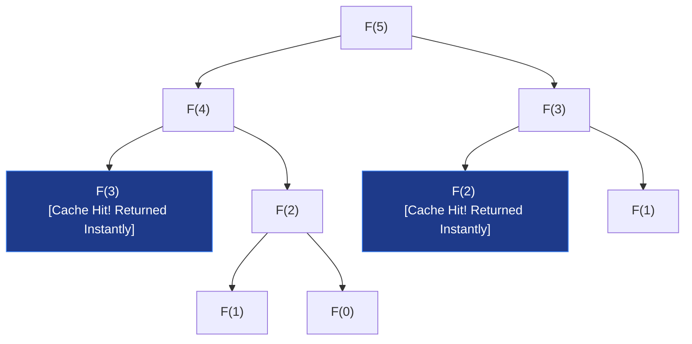

# 🧠 Dynamic Programming (DP) 101 — Foundations & Core Intuition

> "Those who cannot remember the past are condemned to repeat it." — George Santayana

---

## 1. What is Dynamic Programming? (Zero to Hero)

**Dynamic Programming (DP)** is a powerful algorithmic technique used to solve complex problems by breaking them down into simpler, overlapping subproblems. Instead of solving the same subproblem repeatedly, DP solves each subproblem **exactly once** and stores the result in a table (memory) for future lookup.

> [!TIP]
> **The Simple Truth About DP**
> DP is not magic. It is simply **Recursion + Caching** (Top-Down Memoization) or an **Iterative Table Builder** (Bottom-Up Tabulation). If you understand recursion, you are already halfway to mastering DP.

---

## 2. The Two Golden Rules of DP

You can only apply Dynamic Programming to a problem if it satisfies two distinct properties:

### 🔹 Rule 1: Overlapping Subproblems
The recursive solution to the problem solves the **same subproblems** over and over again with the same input parameters. 
* *Example*: In computing the 5th Fibonacci number $F(5) = F(4) + F(3)$, both branches end up recursively calling $F(3)$, $F(2)$, etc., multiple times. DP caches these results to avoid duplicate work.

### 🔹 Rule 2: Optimal Substructure
The optimal solution to the overall problem can be constructed efficiently from the **optimal solutions of its subproblems**.
* *Example*: The shortest path from City A to City C passing through City B is the combination of the shortest path from A to B and the shortest path from B to C.

---

## 3. Top-Down vs. Bottom-Up: The Execution Models

There are two primary paradigms to implement a DP solution:

| Paradigm | Method | Data Structure | Stack Overhead | Intuition |
| :--- | :--- | :--- | :--- | :--- |
| **Top-Down** | **Memoization** (Recursion + Cache) | Hash Map or Array | Yes (Recursion Stack) | Start with the big problem, recursively break it down, and cache solved inputs. |
| **Bottom-Up** | **Tabulation** (Iterative Table) | 1D or 2D Array | No (Pure Loop) | Start with the simplest base cases, fill the table sequentially, and build up to the answer. |

### ⚠️ Handling Python's Recursion Stack Depth Limit
When using Top-Down Memoization, a deep recursive call tree can exceed the default Python system call stack limit (usually `1000`), triggering a `RecursionError: maximum recursion depth exceeded`.
* **The Solution**: If a Top-Down approach is preferred for readability, expand the system limits at the beginning of the program:
  ```python
  import sys
  # Increase recursion depth limit to support deep call stacks
  sys.setrecursionlimit(10000)
  ```
* **Production Recommendation**: For production-grade or highly constrained SDE2 runs, **Bottom-Up Tabulation** is preferred as it completely eliminates stack depth overhead by executing inside iterative heap-based loops.

---

## 3.5 How to Determine State Dimensions

One of the greatest points of confusion for candidates is deciding whether a DP table should be **1D, 2D, or 3D**. The rule of thumb is: **The number of dimensions equals the number of independent variables required to uniquely define a subproblem.**

```
   1D DP  ➔  Linear state. Varies by a single index (e.g., array index i).
   2D DP  ➔  Grid/Matrix state. Varies by two bounds (e.g., indices i and j, or index i + weight w).
   3D DP  ➔  Volume state. Varies by three bounds (e.g., index i + constraint k + action state s).
```

### Deciding Factors:
1. **Single Sequence / Index Varies**: If you only need to know the current index in a single array (e.g., House Robber, Fibonacci, Climbing Stairs), use a **1D state** `dp[i]`.
2. **Two Sequences / Grids**: If you are comparing two strings (e.g., LCS, Edit Distance) or traversing a 2D coordinate space (e.g., Unique Paths), you need a **2D state** `dp[i][j]` to represent coordinates or indices.
3. **Bound Constraints**: If you traverse a single array but have a secondary variable constraint (e.g., remaining capacity `w` in Knapsack, or remaining transactions `k` in Stock Trading), you need a **2D state** `dp[i][w]`. If you have multiple distinct bounds, expand to **3D or 4D**.

---

## 4. The 5-Step DP Framework

To solve any DP problem in an interview, do not guess the table size or transitions blindly. Always follow this systematic 5-step framework:

```
┌──────────────────────────────────────────────────────────┐
│                   THE 5-STEP DP FRAMEWORK                │
├──────────────────────────────────────────────────────────┤
│  1. Define the State (e.g., what does dp[i] represent?)   │
│  2. Identify the Base Cases (simplest inputs)            │
│  3. Formulate the State Transition (the recurrence)      │
│  4. Choose Computation Order (Top-Down or Bottom-Up)     │
│  5. Optimize Space Complexity (reduce array dimensions)   │
└──────────────────────────────────────────────────────────┘
```

---

## 5. Practical Walkthrough: Fibonacci Sequence

Let us trace the evolution of the Fibonacci problem ($F(n) = F(n-1) + F(n-2)$) through the framework to see how complexity is dramatically reduced.

### Phase A: Plain Recursion (The Zero State)
We do not cache anything. We blindly branching downwards.

```python
def fib_naive(n):
    if n <= 1:
        return n
    return fib_naive(n - 1) + fib_naive(n - 2)
```
* **Time Complexity**: $O(2^n)$ — Exponential time due to massive duplicate recursive branches.
* **Space Complexity**: $O(n)$ — Depth of the recursion tree.

### Phase B: Top-Down DP (Memoization)
We introduce an array or hash map to store results once computed.

```python
def fib_memo(n):
    memo = {}
    
    def helper(i):
        if i <= 1:
            return i
        if i in memo:
            return memo[i]  # Cache hit!
            
        memo[i] = helper(i - 1) + helper(i - 2)  # Cache miss, record it
        return memo[i]
        
    return helper(n)
```
* **Time Complexity**: $O(n)$ — Each subproblem from $0$ to $n$ is evaluated exactly once.
* **Space Complexity**: $O(n)$ — Caching table + recursion call stack.

### Phase C: Bottom-Up DP (Tabulation)
We remove recursion entirely and build an iterative array from base cases up to $n$.

```python
def fib_tabulation(n):
    if n <= 1:
        return n
    
    # 1. State definition: dp[i] stores the i-th Fibonacci number
    dp = [0] * (n + 1)
    
    # 2. Base Cases
    dp[0] = 0
    dp[1] = 1
    
    # 3. State Transition: Iterative computation
    for i in range(2, n + 1):
        dp[i] = dp[i - 1] + dp[i - 2]
        
    return dp[n]
```
* **Time Complexity**: $O(n)$ — Single sequential loop.
* **Space Complexity**: $O(n)$ — Size of the `dp` array. Eliminates recursive stack overhead.

### Phase D: Space-Optimized DP (The Hero State)
Observe the state transition: `dp[i] = dp[i-1] + dp[i-2]`. To compute the current value, we **only** need the immediate last two values. We do not need the entire historical array!

```python
def fib_optimized(n):
    if n <= 1:
        return n
    
    # Keep only the last two states
    prev2, prev1 = 0, 1
    
    for i in range(2, n + 1):
        current = prev1 + prev2
        prev2 = prev1  # Shift sliding window
        prev1 = current
        
    return prev1
```
* **Time Complexity**: $O(n)$
* **Space Complexity**: $O(1)$ — Only stores three integer variables. Absolute optimal design.

---

## 6. Practical Example: Climbing Stairs

### Problem Statement
You are climbing a staircase. It takes `n` steps to reach the top. Each time you can either climb `1` or `2` steps. In how many distinct ways can you climb to the top?

### Apply the 5-Step Framework:
1. **Define the State**: Let `dp[i]` be the number of distinct ways to reach step `i`.
2. **Find Base Cases**: 
   * `dp[1] = 1` (1 way to climb 1 step)
   * `dp[2] = 2` (2 ways: `1+1` or `2` steps)
3. **Formulate the Transition**: To reach step `i`, you must come from either step `i-1` (climbing 1 step) or step `i-2` (climbing 2 steps).
   $$ dp[i] = dp[i-1] + dp[i-2] $$
4. **Choose Order**: Iterative Bottom-Up tabulation.
5. **Optimize Space**: Since it relies on the last two states, compress to $O(1)$ space.

```python
def climb_stairs(n):
    if n <= 2:
        return n
    
    # O(1) Space implementation
    prev2, prev1 = 1, 2
    
    for i in range(3, n + 1):
        current = prev1 + prev2
        prev2 = prev1
        prev1 = current
        
    return prev1
```

---

## 🖼️ Visual: Fibonacci Recursion Tree (The Caching Benefit)

Without DP, $F(2)$ and $F(3)$ are recalculated multiple times. Memoization trims these branches immediately:



---
*Last updated: May 2026*
