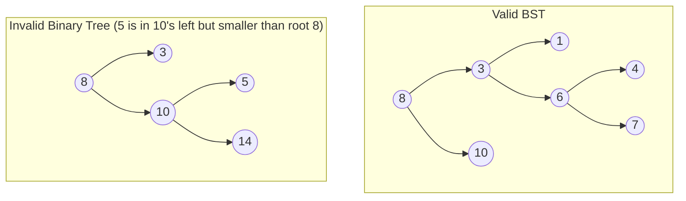

# 🌲 Binary Search Tree (BST) — Detailed Notes

> A hierarchical, node-based tree data structure maintaining sorted elements for quick retrieval, insertion, and deletion.

---

## 1. Introduction & BST Properties

A **Binary Search Tree (BST)** is a binary tree where nodes are ordered according to the following key properties:
* The **left subtree** of a node contains only nodes with keys **less than** the node's key.
* The **right subtree** of a node contains only nodes with keys **greater than** the node's key.
* Both the left and right subtrees must also be binary search trees.
* Duplicate keys are generally not allowed (or handled consistently, e.g., stored in the left subtree or via frequency counters).

### 💡 The Core Benefit
BST bridges the gap between the fast search capabilities of a sorted array ($O(\log n)$) and the fast dynamic insertion and deletion capabilities of a Linked List ($O(1)$ after finding the node).

---

## 2. Complexity Analysis

| Operation | Average Case | Worst Case (Degenerate) | Notes |
| :--- | :--- | :--- | :--- |
| **Search** | $O(\log n)$ | $O(n)$ | Worst case occurs when nodes are inserted in sorted order (skewed tree). |
| **Insert** | $O(\log n)$ | $O(n)$ | Same path traversal as searching for the insertion spot. |
| **Delete** | $O(\log n)$ | $O(n)$ | Involves searching and restructuring pointers. |
| **Space** | $O(n)$ | $O(n)$ | For storing $n$ nodes. Auxiliary stack space is $O(h)$ where $h$ is tree height. |

---

## 3. Core Operations in Python

Let's define a standard Node representation and implement the three primary BST operations.

```python
class TreeNode:
    def __init__(self, val=0, left=None, right=None):
        self.val = val
        self.left = left
        self.right = right
```

### Search Operation
Traverse recursively: go left if target is smaller than the current node, or right if it is larger.

```python
def search_bst(root, target):
    if not root or root.val == target:
        return root
    
    if target < root.val:
        return search_bst(root.left, target)
    return search_bst(root.right, target)
```

### Insertion Operation
Search for the correct empty spot (leaf child pointer) and insert the new node there.

```python
def insert_bst(root, val):
    if not root:
        return TreeNode(val)
    
    if val < root.val:
        root.left = insert_bst(root.left, val)
    elif val > root.val:
        root.right = insert_bst(root.right, val)
        
    return root
```

### Deletion Operation
Deletion is divided into three distinct scenarios:
1. **Node is a leaf** (0 children): Simply delete the node.
2. **Node has one child**: Bypass the node, linking its parent directly to its child.
3. **Node has two children**: Find the node's **inorder successor** (the minimum value in its right subtree), copy its value to the target node, and recursively delete the successor node.

```python
def get_min_value_node(node):
    current = node
    while current.left is not None:
        current = current.left
    return current

def delete_bst(root, val):
    if not root:
        return root
    
    # 1. Search for the node to delete
    if val < root.val:
        root.left = delete_bst(root.left, val)
    elif val > root.val:
        root.right = delete_bst(root.right, val)
    else:
        # Node found! Handle the cases:
        
        # Case A: 0 or 1 child
        if not root.left:
            temp = root.right
            root = None
            return temp
        elif not root.right:
            temp = root.left
            root = None
            return temp
            
        # Case B: 2 children
        # Get successor (min in right subtree)
        temp = get_min_value_node(root.right)
        
        # Copy successor's value to current node
        root.val = temp.val
        
        # Delete the successor node recursively
        root.right = delete_bst(root.right, temp.val)
        
    return root
```

---

## 4. Traversals & Properties

The order in which you visit tree nodes determines what output you generate:
1. **Inorder Traversal (Left, Root, Right)**: Yields node values in **strictly sorted ascending order**.
2. **Preorder Traversal (Root, Left, Right)**: Useful for copying or serializing trees.
3. **Postorder Traversal (Left, Right, Root)**: Useful for deletions (bottom-up processing, e.g., calculating subtree height).

---

## 5. Self-Balancing Binary Search Trees

To guarantee $O(\log n)$ operations even in the worst-case insertion sequences, trees must balance themselves automatically. 
* **AVL Trees**: Strict height balancing. The height difference of left/right subtrees (balance factor) can be at most 1. Employs single and double rotations. Fast searches but slightly slower modifications.
* **Red-Black Trees**: Slightly looser balancing. Nodes are colored Red or Black. Guarantees that the path from the root to the furthest leaf is no more than twice as long as the path to the nearest leaf. Used in standard library mappings (e.g., C++ `std::map`, Java `TreeMap`).

---

## 6. Common Pitfalls & Gotchas

* **Degenerate Trees**: Failing to use balanced trees in production when insertion values are sorted, leading to StackOverflow errors or $O(n)$ latency.
* **Unbalanced Heights**: Forgetting that tree traversal depth matches tree height, not node count.
* **Failing to Reassign Pointers**: When implementing operations recursively (like insert/delete), failing to do `root.left = delete_bst(root.left, val)` can result in changes being dropped.
* **Incorrect Successor Finding**: The inorder successor is the *minimum of the right subtree*, not just the immediate right child.

---

## 7. Interview Q&A

**Q1: How do you validate if a Binary Tree is a valid BST?**
> A common trap is checking only if a node's left child is smaller and right child is larger. However, all nodes in the left subtree must be smaller than the ancestor root.
> **Correct Approach**: Pass a range `[min_val, max_val]` downwards recursively.
> ```python
> def is_valid_bst(root, min_val=float('-inf'), max_val=float('inf')):
>     if not root:
>         return True
>     if not (min_val < root.val < max_val):
>         return False
>     return (is_valid_bst(root.left, min_val, root.val) and 
>             is_valid_bst(root.right, root.val, max_val))
> ```

**Q2: What is the Inorder Successor of a node in a BST?**
> The inorder successor is the node that comes immediately after the given node in an inorder traversal.
> - **Case A**: Node has a right subtree. The successor is the minimum node in that right subtree.
> - **Case B**: Node has no right subtree. The successor is the lowest ancestor whose left child is also an ancestor of the node.

---

## 🖼️ Visual: Valid BST vs. Invalid Binary Tree



---
*Last updated: May 2026*
