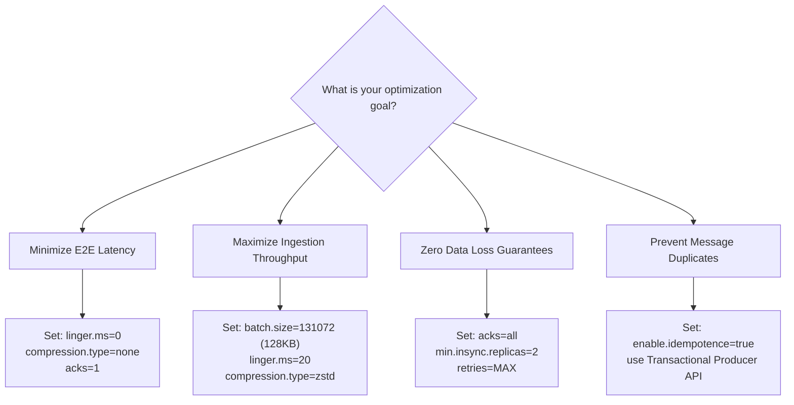
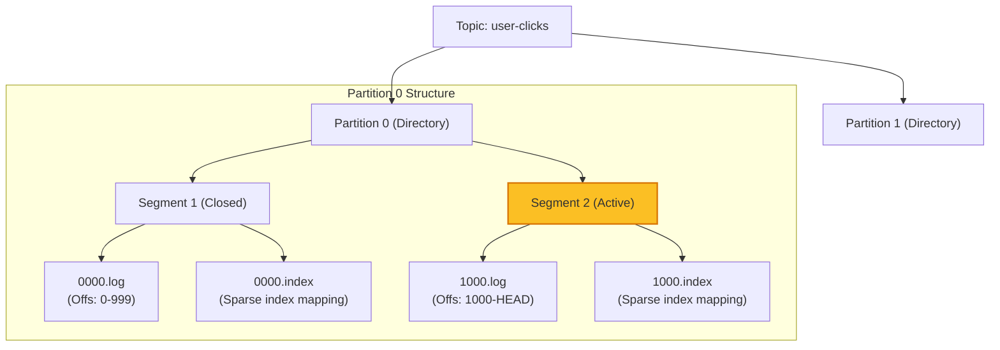
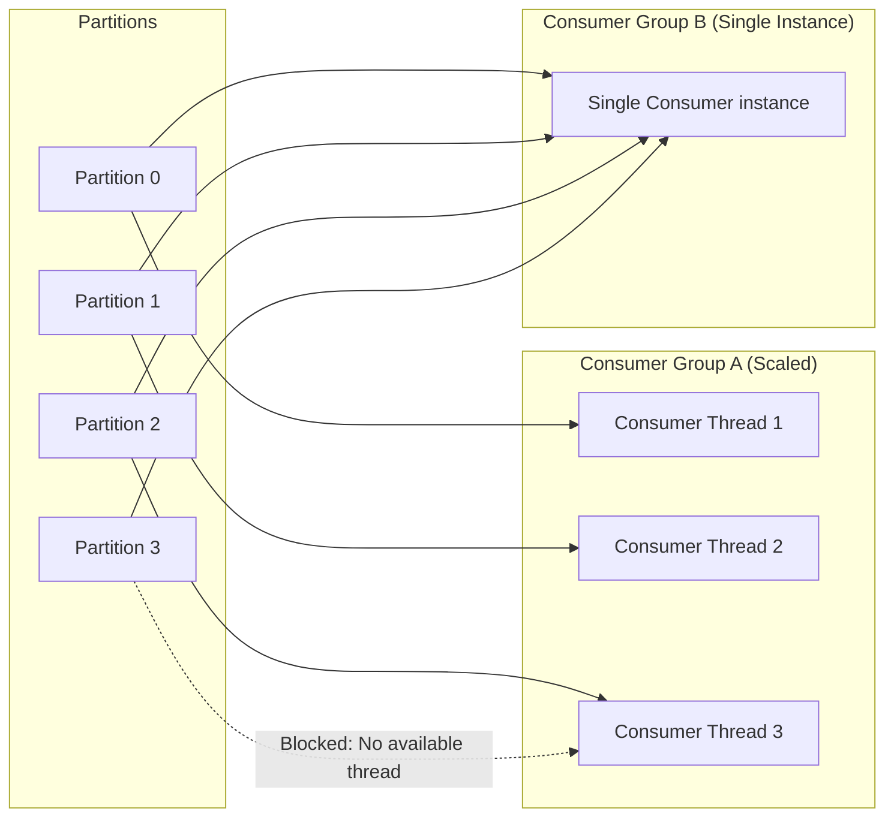
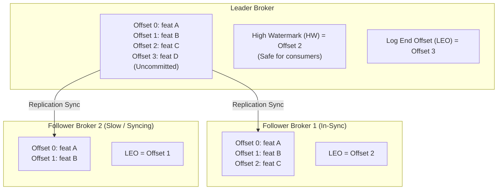

# 📨 Apache Kafka (Distributed Streaming Platform) - Complete 101 Guide

> A premium, comprehensive reference guide covering Apache Kafka's append-only commit log architecture, broker partition internals, producer-consumer rebalance protocols, ZooKeeper vs. KRaft metadata evolution, hands-on CLI labs, and SDE2-level interview preparation.

---

## 📚 Table of Contents

- [🎴 Quick Reference Card](#-quick-reference-card)
- [🎯 The 20% You Need 80% of the Time](#-the-20-you-need-80-of-the-time)
- [💡 Introduction & Overview](#-introduction--overview)
- [🧩 Core Concepts & Kafka Internals](#-core-concepts--kafka-internals)
- [🖼️ Visual Explanations (Mermaid)](#-visual-explanations-mermaid)
- [📖 Topic-Specific Deep Dives](#-topic-specific-deep-dives)
  - [Replication & Consensus](#1-replication--consensus)
  - [Delivery Guarantees & Transactions](#2-delivery-guarantees--transactions)
  - [Spark Structured Streaming Integration](#3-spark-structured-streaming-integration)
- [⚖️ Trade-offs & Comparisons](#-trade-offs--comparisons)
- [📊 Practical Configurations & Code](#-practical-configurations--code)
- [🔬 Hands-on Practice Labs](#-hands-on-practice-labs)
- [⚠️ Common Pitfalls & Anti-patterns](#-common-pitfalls--anti-patterns)
- [🔧 Troubleshooting & Production Gotchas](#-troubleshooting--production-gotchas)
- [💼 Interview FAQs (30 Questions)](#-interview-faqs-30-questions)
- [🔗 Related Topics](#-related-topics)

---

## 🎴 Quick Reference Card

| Aspect | Details |
| :--- | :--- |
| **What is Kafka?** | A highly scalable, fault-tolerant distributed publish-subscribe messaging system designed around a high-performance **immutable append-only commit log**. |
| **Why Use It?** | Ultra-high throughput (millions of events/sec), low latency (sub-millisecond), durable disk storage, message decoupling, and real-time processing stream capabilities. |
| **When to Use?** | Event-driven microservices architectures, real-time log ingestion (ELK/Splunk), change data capture (CDC), streaming analytics (Flink/Spark), and user activity tracking. |

**Key Takeaway**: Kafka is not an active queuing system like RabbitMQ; it is a **dumb broker / smart client** system. The broker maintains a static append-only sequential file on disk, while consumers maintain their own pointer state (offsets), enabling unlimited historical replays.

---

## 🎯 The 20% You Need 80% of the Time

### Critical Concepts (Master These First)

1. **Partitions & Sequential Disk I/O**: A Kafka topic is divided into partitions. Each partition is an ordered, immutable, append-only log. Since Git-like writes are strictly append-only, Kafka leverages **OS Page Caching** and sequential disk access, which is nearly as fast as RAM.
2. **Consumer Groups & Parallelism**: Scalability is achieved by grouping consumer instances. Each consumer in a group is assigned a distinct subset of partitions. **Constraint**: A single partition can only be read by one consumer thread in a group, limiting group scaling capacity to the topic's partition count.
3. **In-Sync Replicas (ISR)**: For durability, partitions are replicated across brokers. The Leader broker handles all reads and writes, while Followers sync in the background. The **ISR** represents the subset of followers actively caught up with the Leader.

### Core CLI Commands

```bash
# 1. Create a topic with partitions and replication factor
kafka-topics.sh --create --bootstrap-server localhost:9092 \
  --replication-factor 3 --partitions 6 --topic orders.incoming

# 2. List all topics
kafka-topics.sh --list --bootstrap-server localhost:9092

# 3. Describe topic configurations (crucial for checking partition skew and ISR)
kafka-topics.sh --describe --topic orders.incoming --bootstrap-server localhost:9092

# 4. Produce messages (console interface)
kafka-console-producer.sh --bootstrap-server localhost:9092 --topic orders.incoming

# 5. Consume messages from beginning
kafka-console-consumer.sh --bootstrap-server localhost:9092 \
  --topic orders.incoming --from-beginning

# 6. Check consumer group offsets and lag calculations (production auditing)
kafka-consumer-groups.sh --bootstrap-server localhost:9092 \
  --describe --group billing-service-group
```

### Quick Decision Tree



---

## 💡 Introduction & Overview

### What is Apache Kafka?

Apache Kafka is a distributed streaming platform designed to handle real-time data feeds. Developed initially at LinkedIn in 2011 and open-sourced through Apache, Kafka has transitioned from a high-throughput pub-sub queue to the backbone of modern stream-processing data architectures.

### Why Does It Matter?

- **Extreme Scalability**: Decouples read and write pathways horizontally. You scale ingestion throughput by adding partitions and scale consumption by adding consumer nodes to a consumer group.
- **Durable Retention**: Unlike traditional message brokers (like RabbitMQ) that delete messages immediately after consumer acknowledgment, Kafka persists messages on disk based on time or size limits. This enables historic re-plays and retroactive processing.
- **High Performance**:
  - **Zero-Copy**: Bypasses copying data to user space. Using the OS `sendfile` system call, Kafka moves bytes directly from the OS Page Cache to the network socket, removing CPU context-switching overhead.
  - **Sequential Disk Writes**: Appends data to files, eliminating random disk seek operations.

---

## 🧩 Core Concepts & Kafka Internals

### 1. Kafka Internals: The Append-Only Commit Log

At the system level, a topic partition corresponds directly to a directory on the broker's local filesystem: `/var/lib/kafka/data/TOPIC-PARTITION/`. Within this directory, Kafka divides the log into **Segments**:

```text
00000000000000000000.log      # Raw message bytes (append-only)
00000000000000000000.index    # Maps logical offsets to byte positions in the .log file
00000000000000000000.timeindex# Maps message timestamps to logical offsets
```

- **Active Segment**: Only one segment is written to at any time. When it reaches its size threshold (`log.segment.bytes`, default 1GB) or time threshold (`log.roll.hours`), the segment is closed and a new active segment is created.
- **Index Files**: Because disk reads are sequential, searching for offset `40251` in a massive 1GB log would require a slow full-scan. Kafka maintains sparse index files that store byte-offset mappings every few kilobytes, reducing search times to $O(1)$ memory seek times.

---

### 2. Producer Internals: Record Accumulator & Batching

When you call `producer.send()`, the record does not immediately travel over the network. It passes through several internal layers:

1. **Serializer**: Transforms the key and value objects into raw byte arrays.
2. **Partitioner**: Determines which partition the record belongs to. If a key is provided, it hashes the key (`MurmurHash2`) and computes the target partition: `Math.abs(hash(key)) % total_partitions`. If no key exists, it leverages a sticky partitioning strategy to pack batches.
3. **RecordAccumulator**: The heart of producer batching. Records are grouped into memory batches per partition. The producer thread waits until either:
   - The batch size reaches its limit: `batch.size` (default 16KB).
   - The time limit expires: `linger.ms` (default 0ms).
4. **Sender Thread**: Picks up the fully packed batches and transmits them asynchronously to the target broker.

---

### 3. Consumer Group Rebalancing

When a consumer instance joins or leaves a consumer group, or partitions are added to a topic, Kafka triggers a **Rebalance**, reassigning partitions among the group's active members.

- **Group Coordinator**: A specific Kafka broker elected to manage group heartbeats and partition assignments.
- **Heartbeats**: Consumers periodically send background heartbeats (`heartbeat.interval.ms`, default 3s) to the Group Coordinator. If a consumer fails to send heartbeats for a duration longer than `session.timeout.ms` (default 45s), it is declared dead and a rebalance is triggered.
- **Rebalance Protocols**:
  - **Eager Rebalance**: During a rebalance, all consumers stop reading, revoke their current partition assignments, join the group again, and receive new partition maps. This causes a "stop-the-world" processing freeze.
  - **Cooperative Sticky Rebalance**: Gradually revokes and transfers only the specific partitions that need to be migrated, allowing unaffected consumers to continue reading throughout the process.

---

## 🖼️ Visual Explanations (Mermaid)

### 1. Topic Partitions & Log Segments

Illustrating how a topic is partitioned and how each partition is split into index and log segments on physical disks:



---

### 2. Consumer Group Partition Allocation

How partitions are distributed. Since Partition 3 has no unique consumer, it sits idle for Group A, but Group B's single consumer handles all partitions seamlessly:



---

### 3. Replication Status & High Watermark

Illustrating the relationship between the Log End Offset (LEO), which tracks all incoming writes, and the High Watermark (HW), which tracks only the fully replicated commits:



---

## 📖 Topic-Specific Deep Dives

### 1. Replication & Consensus

#### A. In-Sync Replicas (ISR)
The Leader broker maintains a list of ISRs. Followers must query the Leader periodically to pull new commits.
- If a follower stops fetching for a period exceeding `replica.lag.time.max.ms` (default 30 seconds), the Leader dynamically removes it from the ISR pool.
- If a follower catches up later, it is automatically re-added to the ISR list.

#### B. ZooKeeper vs. KRaft
- **ZooKeeper Mode (Legacy)**: Kafka historically relied on Apache ZooKeeper to manage cluster metadata, broker registries, partition leader elections, and topic configurations.
  - *Bottleneck*: In large clusters with hundreds of thousands of partitions, ZooKeeper leader election updates are slow, and ZooKeeper itself acts as a single point of failure and bottleneck during broker restarts.
- **KRaft Mode (Modern - Kafka 3.x / 4.0)**: **Kafka Raft Metadata Mode** replaces ZooKeeper entirely. Metadata is stored natively in a internal Kafka topic (`@metadata`). One of the active brokers is elected as the metadata Leader, replicating state changes via a customized Raft consensus protocol.
  - *Benefit*: Near-instantaneous partition leader elections, simplified cluster operations, and support for millions of active partitions.

---

### 2. Delivery Guarantees & Transactions

#### At-least-once (Standard Default)
- **Producer**: `acks=all` (or `1`), retries enabled.
- **Consumer**: Disables auto-commit, processing the message first and manually committing the offsets to `__consumer_offsets`.
- **Failure Mode**: If a consumer processes a message and crashes before committing the offset, the replacement consumer reads the message again, causing downstream duplicates.

#### At-most-once
- **Producer**: `acks=0` (fire-and-forget).
- **Consumer**: Enables auto-commit (`enable.auto.commit=true`).
- **Failure Mode**: Offsets are committed immediately upon fetch. If the consumer crashes during processing, the message is lost forever.

#### Exactly-Once Semantics (EOS)
Exactly-once in Kafka is achieved by combining **Idempotent Producers** with **Transactional Writes**:
1. **Idempotent Producer**:
   - The producer receives a unique Producer ID (PID) and a monotonically increasing Sequence Number for each batch.
   - The broker tracks sequence numbers per partition. If a duplicate batch arrives due to a retry, the broker discards it but acknowledges the write, ensuring zero duplicate records in the log.
2. **Transactional API (`read-process-write`)**:
   - Allows a consumer to read from a topic, update state, and write offsets/results to downstream topics in a single atomic transaction.
   - If any step fails, the transaction is rolled back. Downstream consumers configure `isolation.level=read_committed` to ignore uncommitted transaction fragments.

---

### 3. Spark Structured Streaming Integration

When integrating Apache Spark with Kafka, Spark takes over offset tracking from Kafka, storing offsets inside its own metadata checkpoint directory to ensure exactly-once end-to-end pipelines.

#### Core Stream Ingestion Logic
```python
# Read streaming data from Kafka brokers
kafka_stream_df = spark.readStream \
    .format("kafka") \
    .option("kafka.bootstrap.servers", "localhost:9092") \
    .option("subscribe", "orders.incoming") \
    .option("startingOffsets", "latest") \
    .load()

# Transform: Cast binary key/value fields to readable strings
parsed_df = kafka_stream_df.selectExpr("CAST(key AS STRING) as order_id", "CAST(value AS STRING) as payload")
```

- **Trigger Interval**: Defines how frequently Spark queries Kafka for new micro-batches (`.trigger(processingTime='10 seconds')`).
- **Checkpointing**: In the event of a failure, Spark reads the checkpoint directory to recover the exact offsets it was processing, preventing double-processing or data loss when writing to downstream Delta or Iceberg tables.

---

## ⚖️ Trade-offs & Comparisons

### Kafka vs. RabbitMQ vs. Pulsar

| Aspect | Apache Kafka | RabbitMQ | Apache Pulsar |
| :--- | :--- | :--- | :--- |
| **Architecture** | Append-Only Commit Log. | Smart broker queue routing. | Tiered storage (BookKeeper + Brokers). |
| **Messaging Paradigm**| Pub-Sub / Pull-based logs. | Push-based queues. | Unified (Queuing + Streaming). |
| **Storage Model** | Local disk page cache. | Memory-centric (flushes to disk). | Separate storage nodes. |
| **Scalability** | Extremely High (Partition bound).| Medium (CPU routing limits). | Very High (Segment-based). |
| **Replay Capabilities**| Native. Read from any offset. | None. Messages deleted on ACK. | Native. |

---

### ZooKeeper vs. KRaft

| Dimension | ZooKeeper Mode | KRaft Mode |
| :--- | :--- | :--- |
| **External Dependencies** | High. Requires maintaining a separate ZK cluster. | Zero. Metadata is integrated directly. |
| **Replication Protocol** | Zab (ZooKeeper Atomic Broadcast). | Raft-based metadata log. |
| **Partition Limit** | Up to ~200,000 partitions. | Supported up to millions of partitions. |
| **Leader Failover Time** | Seconds to minutes (slow cluster syncs). | Milliseconds (instant native metadata updates). |

---

## 📊 Practical Configurations & Code

### High-Throughput Producer Settings
Optimize your configurations to maximize ingestion bandwidth:

```ini
# Maximum acks speed without losing broker-write confirmations
acks=all
# Enforce message idempotency (required for transactions)
enable.idempotence=true
# Wait up to 20ms to allow batching before sending
linger.ms=20
# Maximum batch allocation size per partition (128KB)
batch.size=131072
# Allocate 32MB of buffer memory for waiting threads
buffer.memory=33554432
# Compress using high-efficiency zstd
compression.type=zstd
```

---

### End-to-End PySpark Pipeline
A complete Python script checking out events from a Kafka topic and saving them dynamically to a Bronze Delta table:

```python
from pyspark.sql import SparkSession
from pyspark.sql.functions import col, from_json
from pyspark.sql.types import StructType, StructField, StringType, DoubleType

# 1. Initialize local Spark session with Kafka and Delta packages
spark = SparkSession.builder \
    .appName("KafkaToDeltaStreaming") \
    .config("spark.jars.packages", "org.apache.spark:spark-sql-kafka-0-10_2.12:3.5.0,io.delta:delta-spark_2.12:3.0.0") \
    .config("spark.sql.extensions", "io.delta.sql.DeltaSparkSessionExtension") \
    .config("spark.sql.catalog.spark_catalog", "org.apache.spark.sql.delta.catalog.DeltaCatalog") \
    .getOrCreate()

# 2. Define target schema for incoming JSON payloads
order_schema = StructType([
    StructField("order_id", StringType(), True),
    StructField("customer_id", StringType(), True),
    StructField("amount", DoubleType(), True),
    StructField("status", StringType(), True)
])

# 3. Read streaming data from Kafka
kafka_raw_df = spark.readStream \
    .format("kafka") \
    .option("kafka.bootstrap.servers", "localhost:9092") \
    .option("subscribe", "orders.incoming") \
    .option("startingOffsets", "earliest") \
    .load()

# 4. Process and structure the data payload
processed_df = kafka_raw_df \
    .selectExpr("CAST(value AS STRING) as json_payload", "timestamp as ingested_at") \
    .select(from_json(col("json_payload"), order_schema).alias("data"), col("ingested_at")) \
    .select("data.*", "ingested_at")

# 5. Write the stream to a Delta Table, utilizing checkpoints
query = processed_df.writeStream \
    .format("delta") \
    .outputMode("append") \
    .option("checkpointLocation", "/mnt/datalake/checkpoints/orders_bronze") \
    .start("/mnt/datalake/bronze/orders")

query.awaitTermination()
```

---

## 🔬 Hands-on Practice Labs

### Lab 1: Simulating Consumer Lag & Auto-Rebalancing

Understand what happens when consumers fail or scale within a consumer group:

```bash
# 1. Create a topic with 4 partitions to allow consumer distribution
kafka-topics.sh --create --bootstrap-server localhost:9092 \
  --partitions 4 --replication-factor 1 --topic lag-simulation-topic

# 2. Start a Producer to publish a rapid sequence of test records
for i in {1..200}; do
  echo "key_$i:value_$i"
done | kafka-console-producer.sh --bootstrap-server localhost:9092 \
  --topic lag-simulation-topic --property "parse.key=true" --property "key.separator=:"

# 3. Start Consumer Instance 1 in a dedicated terminal group
kafka-console-consumer.sh --bootstrap-server localhost:9092 \
  --topic lag-simulation-topic --group audit-group

# 4. Describe group status in a separate terminal. Observe that Consumer 1 holds all 4 partitions:
kafka-consumer-groups.sh --bootstrap-server localhost:9092 --describe --group audit-group

# 5. Start Consumer Instance 2 in another terminal using the same group:
kafka-console-consumer.sh --bootstrap-server localhost:9092 \
  --topic lag-simulation-topic --group audit-group

# 6. Audit group status again. Notice that a rebalance has occurred:
# Consumer 1 now holds partitions 0 and 1.
# Consumer 2 now holds partitions 2 and 3.

# 7. Stop Consumer 2. Run group status. Notice that Consumer 1 automatically recovers control of all 4 partitions.
```

---

### Lab 2: Managing Kafka Compaction

Learn how to configure and audit log compaction behavior:

```bash
# 1. Create a compacted topic
kafka-topics.sh --create --bootstrap-server localhost:9092 \
  --topic customer-profiles \
  --partitions 1 \
  --replication-factor 1 \
  --config cleanup.policy=compact \
  --config min.cleanable.dirty.ratio=0.01 \
  --config segment.ms=100

# 2. Produce multiple records with identical keys
# Note: Key is 'user_1'
kafka-console-producer.sh --bootstrap-server localhost:9092 \
  --topic customer-profiles --property "parse.key=true" --property "key.separator=:"
> user_1:name=Vijay,city=Delhi
> user_2:name=John,city=NY
> user_1:name=Vijay,city=SanFrancisco

# 3. Trigger log cleaning by forcing segment rolls (or wait for the cleaner thread)
# 4. Consume the topic. Verify that only the latest state of user_1 is retained:
kafka-console-consumer.sh --bootstrap-server localhost:9092 \
  --topic customer-profiles --from-beginning --property "print.key=true"
# Output:
# user_2:name=John,city=NY
# user_1:name=Vijay,city=SanFrancisco
```

---

## ⚠️ Common Pitfalls & Anti-patterns

### 1. Partition Skew (Hot Partitions)

> [!WARNING]
> Choosing a low-cardinality key (e.g. `country_code` or `status`) causes Kafka to hash records into a very small subset of partitions, leading to unequal consumer loads and high consumer lag on skewed partitions.

#### ❌ Bad Key Choice (Low cardinality)
```python
# Producer.send with low cardinality key
# Hashing 'IN' or 'US' results in traffic overloading only 2 target partitions
producer.send("user-clicks", key=b"IN", value=b"click_event_payload")
```

#### ✅ Best Practice (High cardinality keys or salting)
```python
# 1. High cardinality key distributes traffic evenly across partitions
producer.send("user-clicks", key=b"user_102581", value=b"click_event_payload")

# 2. Or implement salting if key must remain 'IN':
salt = str(random.randint(1, 4))
salted_key = f"IN_{salt}".encode("utf-8")
producer.send("user-clicks", key=salted_key, value=b"click_event_payload")
```

---

### 2. Blindly Committing Offsets Automatically (`enable.auto.commit=true`)

> [!IMPORTANT]
> Auto-commit runs in a background thread every 5 seconds. If a consumer fetches a batch, auto-commits immediately, and crashes during batch processing, the new consumer starts from the committed offset, resulting in silently lost data.

#### ❌ Bad Practice (Auto-commit Enabled)
```python
# Auto-commit handles tracking. High data loss risk during failures.
conf = {
    'bootstrap.servers': "localhost:9092",
    'group.id': "billing-group",
    'enable.auto.commit': True
}
```

#### ✅ Best Practice (Manual synchronous offset commits)
```python
# Manually commit offsets only after data is successfully persisted downstream
conf = {
    'bootstrap.servers': "localhost:9092",
    'group.id': "billing-group",
    'enable.auto.commit': False
}
consumer = Consumer(conf)
# ... inside poll loop ...
try:
    save_to_database(msg.value())
    consumer.commit(asynchronous=False) # Block until commit completes safely
except Exception as e:
    rollback_database()
```

---

### 3. Storing Large Messages Directly in Kafka Topics

> [!CAUTION]
> Kafka is designed for high-frequency, lightweight records. Committing messages larger than 1MB causes performance bottlenecks, high memory pressure on broker JVMs, and slow replication.

#### ❌ Bad Practice (Direct massive payloads)
```python
# Committing a 50MB PDF directly into Kafka
huge_pdf_bytes = read_pdf("contract.pdf")
producer.send("contracts", key=b"contract_101", value=huge_pdf_bytes)
```

#### ✅ Best Practice (Claim Check Pattern)
```python
# 1. Upload the massive payload to secure S3 storage
s3_uri = upload_to_s3("contract.pdf")

# 2. Write only a small reference pointer (metadata) to the Kafka topic
metadata_payload = f'{{"contract_id": "101", "s3_uri": "{s3_uri}"}}'.encode("utf-8")
producer.send("contracts", key=b"contract_101", value=metadata_payload)
```

---

## 🔧 Troubleshooting & Production Gotchas

### 1. Resolving Rebalance Storms
A rebalance storm occurs when a consumer takes longer to process a batch of messages than the threshold defined by `max.poll.interval.ms` (default 5 minutes). The coordinator assumes the consumer is dead, removes it from the group, and triggers a rebalance, initiating an infinite loop of rebalances as subsequent consumers take on the heavy load and timeout in turn.

#### Symptoms
- Consumer lag increases rapidly.
- Log entries show: `Consumer poll timeout has expired. Revoking partitions...`
- High CPU utilization on brokers and consumers due to constant partition remapping.

#### Resolution
1. **Optimize batch sizes**: Reduce `max.poll.records` (default 500) to ensure the batch can be fully processed within the polling interval.
2. **Increase processing timeouts**: Increase `max.poll.interval.ms` to match worst-case downstream processing times.
3. **Use worker threads**: Offload heavy processing from the polling thread to a separate thread pool, keeping the main polling thread free to send heartbeats.

---

### 2. Handling Broker Out of Memory (OOM) Errors
If a broker runs out of memory, it's typically caused by excessive active partition counts or incorrect heap sizing relative to system thread constraints.

#### Checklist
- Ensure Kafka broker heap is sized properly (`KAFKA_HEAP_OPTS="-Xmx4G -Xms4G"`). **Never size JVM heap larger than 6GB** to leave plenty of memory for the OS Page Cache.
- Consolidate under-utilized topics to reduce total partition counts, saving system file handles and broker metadata memory.

---

## 💼 Interview FAQs (30 Questions)

### Basic Questions (Q1-Q10)

**Q1: What is Apache Kafka and what are its key components?**
> Apache Kafka is a distributed streaming platform designed around an immutable append-only commit log. The primary components are:
> - **Broker**: A single Kafka server that stores and serves partition data.
> - **Producer**: Client applications that publish records to Kafka topics.
> - **Consumer**: Client applications that read and process records from topics.
> - **Topic**: A logical category or feed name to which records are published.
> - **Partition**: An ordered, immutable segment of a topic that provides scalability.
> - **Zookeeper / KRaft**: The synchronization and consensus layer managing metadata.

**Q2: What is a partition in Kafka, and why are topics partitioned?**
> A partition is a physical, append-only log file on the broker's disk. 
> - **Why partitioned**:
>   - **Scalability**: Allows a topic's data to exceed the storage limits of a single machine by distributing partitions across multiple brokers.
>   - **Parallelism**: Allows multiple consumers in a group to read from the same topic simultaneously, with each consumer thread mapped to a distinct partition.

**Q3: How does Kafka guarantee message ordering?**
> Message ordering is guaranteed **only within a single partition**, never globally across a topic.
> - **Mechanism**: Within a partition, each message is assigned a sequential offset. Kafka guarantees that consumers read messages from a partition in the exact order they were written.
> - **Achieving Global Order**: To guarantee global topic ordering, you must configure the topic with a **single partition**, which limits consumer group scalability to a single active consumer thread.

**Q4: What is a Consumer Group?**
> A Consumer Group is a logical grouping of consumer instances working together to consume messages from one or more topics.
> - **Mechanism**: Kafka ensures that each partition of a topic is assigned to exactly one consumer thread inside a group. If you have 4 partitions and 4 consumers in a group, each consumer reads from 1 partition. If you add a 5th consumer, it will sit idle.

**Q5: What is an offset in Kafka?**
> An offset is a monotonically increasing 64-bit integer assigned sequentially to each message written to a partition. It uniquely identifies a message's position within that partition, acting as a read pointer for consumers.

**Q6: What is the purpose of the In-Sync Replicas (ISR) list?**
> The ISR is the subset of replica brokers that are fully caught up with the active Leader broker for a given partition.
> - **Significance**: If the partition Leader goes down, only brokers actively on the ISR list are eligible to be elected as the new Leader, preventing data loss.

**Q7: Explain what happens when a producer configuration sets `acks=all`.**
> When `acks=all` (or `acks=-1`), the Leader broker blocks acknowledgement until the record is successfully written to **all active replicas in the ISR list**. This configuration provides the highest level of durability at the cost of write latency.

**Q8: What is the role of Zookeeper in a Kafka cluster?**
> Historically, ZooKeeper managed coordination and consensus:
> - Broker registration and heartbeats.
> - Topic configurations and partition counts.
> - Partition Leader elections.
> - Consumer offset storage (in legacy editions).
> > **Modern Note**: In modern Kafka clusters, ZooKeeper is replaced entirely by KRaft mode.

**Q9: What is Log Compaction?**
> Log Compaction is a retention policy where Kafka guarantees that it retains at least the **latest state (value) for each key** within a topic partition log. Old values for the same key are periodically cleaned, which is ideal for caching and latest-state recovery scenarios.

**Q10: What is consumer lag and why is it monitored?**
> Consumer lag is the difference between the latest offset written by producers to a partition and the offset currently committed by the consumer group.
> - **Why monitored**: High lag indicates the consumer group is processing slower than producers are publishing, serving as a primary indicator of system bottlenecks.

---

### Intermediate Questions (Q11-Q20)

**Q11: Explain how Kafka achieves extreme high-throughput performance (Zero-Copy & Sequential I/O).**
> Kafka achieves high performance through:
> 1. **Sequential I/O**: Kafka appends writes sequentially to disk, which is significantly faster than random disk access.
> 2. **OS Page Cache**: Instead of buffering data in JVM memory, Kafka writes directly to the OS Page Cache.
> 3. **Zero-Copy System Call (`sendfile`)**: When transmitting data to consumers, Kafka uses `sendfile` to bypass copying data to user space. Bytes move directly from the Page Cache to the network buffer, eliminating CPU overhead and context switching.

**Q12: What is the "Smart Client, Dumb Broker" model in Kafka?**
> - **Dumb Broker**: The broker does not track which consumer has read which message. It simply appends records to disk and serves byte ranges starting from a requested offset.
> - **Smart Client**: The consumer maintains its own read pointer state (offset) and handles group coordination, partition assignment, and offset commits, removing state tracking overhead from brokers.

**Q13: What happens during a Consumer Group Rebalance? How does Eager differ from Cooperative Sticky rebalancing?**
> A rebalance re-allocates partition assignments across active group members when consumers join or leave.
> - **Eager Protocol (Legacy)**: Stops all consumption, revokes all partition assignments, and forces all consumers to re-join and receive new maps. Creates a processing pause.
> - **Cooperative Sticky Protocol (Modern)**: Performs a multi-phase reassignment. It only revokes and migrates the specific partitions that need to move, allowing unaffected consumers to continue reading throughout the process.

**Q14: Explain the transactional API (`read-process-write`) in Kafka. How does it work?**
> The transactional API enables atomic operations across multiple partitions and topics:
> 1. The producer registers a `transactional.id` with a **Transaction Coordinator** broker.
> 2. During `read-process-write`, the producer writes output records and consumer offset commits to the broker inside an open transaction block.
> 3. The Transaction Coordinator commits these writes atomically by appending a commit marker to the transaction log.
> 4. Downstream consumers configure `isolation.level=read_committed` to ignore uncommitted or rolled-back transaction fragments.

**Q15: How does the producer partitioner decide which partition to write to?**
> 1. **Explicit Partition**: If a target partition is specified in the record, the partitioner uses it directly.
> 2. **Key-based Hashing**: If a key is provided, it hashes the key using `MurmurHash2` and computes: `Math.abs(hash(key)) % total_partitions` to ensure identical keys always route to the same partition.
> 3. **Sticky Partitioner (No Key)**: Groups records into a single batch for one partition until the batch is full, then switches partitions, reducing network call counts.

**Q16: What is the significance of the `min.insync.replicas` configuration?**
> `min.insync.replicas` defines the minimum number of in-sync replicas that must acknowledge a write when a producer uses `acks=all`.
> - **Behavior**: If the number of active brokers in the ISR list falls below this threshold, the Leader broker rejects writes and throws a `NotEnoughReplicasException`, guaranteeing data is never accepted without meeting durability targets.

**Q17: Describe ZooKeeper vs. KRaft metadata management. Why is KRaft superior?**
> - **ZooKeeper**: Metadata updates require writing to ZK, which then notifies the active Controller broker, which in turn updates other brokers. This introduces coordination latency and acts as a bottleneck when handling more than 200k partitions.
> - **KRaft (Kafka Raft)**: Metadata is replicated natively within a internal Raft-based metadata log topic (`@metadata`). Broker consensus is handled internally, supporting millions of partitions with near-instantaneous controller failover times.

**Q18: What is a Rebalance Storm and how do you diagnose and resolve it?**
> A rebalance storm occurs when consumer instances take longer to process a batch of records than the threshold defined by `max.poll.interval.ms`.
> - **Diagnosis**: The coordinator assumes the consumer is dead, revokes its partitions, and triggers a rebalance. As another consumer picks up the load and times out in turn, the group enters an infinite loop of rebalances.
> - **Resolution**: Reduce `max.poll.records`, optimize processing code, or increase `max.poll.interval.ms`.

**Q19: Explain the difference between `enable.idempotence=true` and transactional APIs.**
> - **Idempotent Producer (`enable.idempotence=true`)**: Prevents duplicate writes from being introduced by the producer due to network retries. Works at the individual partition level using tracking IDs and sequence numbers.
> - **Transactional API**: Provides atomicity across **multiple partitions and topics**, ensuring that a series of writes and offset commits either succeed together or fail completely.

**Q20: How does Spark Structured Streaming maintain state during windowed aggregations over Kafka?**
> Spark uses **State Store Providers** (like HDFS Backed State Store or RocksDB) to maintain intermediate aggregation state across micro-batches.
> - **Watermarking**: Spark uses watermarks (`withWatermark()`) to define how long it will wait for late-arriving events based on event-time timestamps before dropping them and cleaning state memory.

---

### Advanced Questions (Q21-Q30)

**Q21: Walk through the end-to-end write and read paths in Kafka, detailing internal broker buffers.**
> **Write Path**:
> 1. The client sends a produce request. The broker's Network Thread puts the request in the Request Queue.
> 2. An I/O Thread picks up the request, validates the schema, and appends the records directly to the partition's active Log Segment.
> 3. The I/O Thread returns an acknowledgement to the client (based on `acks` configuration).
> 4. Followers pull updates from the Leader asynchronously to update their local logs.
> **Read Path**:
> 1. The consumer client sends a fetch request specifying the target partition and offset.
> 2. The broker's I/O thread verifies the requested offset is less than the High Watermark (HW) to prevent reading uncommitted data.
> 3. The broker uses the `sendfile` system call to transfer byte ranges directly from the OS Page Cache to the network buffer, bypassing user space copies and maximizing throughput.

**Q22: Explain the significance of the High Watermark (HW) and Log End Offset (LEO) in replication.**
> - **Log End Offset (LEO)**: Represents the offset of the next record to be written to a partition. Every replica broker maintains its own LEO.
> - **High Watermark (HW)**: Represents the largest offset that has been successfully replicated to all active in-sync replicas (ISR) for a partition.
>   - *Consumer Restriction*: Consumers can only read messages up to the High Watermark. This prevents "dirty reads" of data that could be lost if the Leader broker crashes before replication completes.

**Q23: How does log compaction merge clean and dirty segments? Describe the internal cleaning phases.**
> The log cleaner thread splits a compacted topic partition log into two regions:
> 1. **Clean region**: Already compacted. Contains only one unique record per key.
> 2. **Dirty region**: Appended since the last compaction phase. Contains duplicate keys.
> - **Compaction Process**: The cleaner thread builds an in-memory Skimpy Offset Map using the dirty region, mapping the MD5 hash of each key to its highest offset. It then copies clean and dirty segments to new segments, discarding records whose offsets are lower than the corresponding offset in the map.

**Q24: What is the "Claim Check" pattern and how is it implemented in high-volume streaming architectures?**
> The Claim Check pattern is used to process large payloads without bloating message queues:
> 1. The producer uploads the large payload (e.g. >1MB binary or image) to a high-capacity object store like Amazon S3 or Azure Blob Storage.
> 2. The producer writes a lightweight message to the Kafka topic containing the metadata reference and the storage URI (the "claim check").
> 3. The consumer reads the claim check from Kafka and downloads the payload directly from the object store, maintaining broker performance.

**Q25: Walk through a scenario where a consumer group partition count is doubled. What is the impact on active consumer threads?**
> Doubling partition counts (e.g. from 4 to 8) increases topic throughput and parallelism:
> - **Active Group Impact**: If the group currently has 4 consumer instances (each reading from 1 partition), doubling the partitions to 8 will trigger a rebalance.
> - **Post-Rebalance**: Each of the 4 consumers will be assigned 2 partitions, allowing the group to leverage the increased partition count immediately. To scale consumption further, you can add 4 more consumer instances to the group.

**Q26: Explain the difference between Eager and Cooperative Sticky assignment algorithms at the algorithmic level.**
> - **Eager (Range/RoundRobin/Sticky)**:
>   - Algorithmic Phase: A single phase. Every consumer revokes its partition map and sends a JoinGroup request. The Leader consumer receives the full list of members and assigns partitions from scratch. All consumption stops during this phase.
> - **Cooperative Sticky**:
>   - Algorithmic Phase: A multi-phase process. 
>     - *Phase 1*: Consumers send JoinGroup requests while retaining their current partition assignments.
>     - *Phase 2*: The coordinator determines which partitions need to migrate and revokes only those specific partitions, leaving others untouched.
>     - *Phase 3*: The revoked partitions are reassigned, minimizing consumption downtime.

**Q27: How does Kafka guarantee exactly-once processing when writing to third-party databases?**
> Kafka's native Exactly-Once Semantics (EOS) only apply within Kafka-to-Kafka boundaries. To guarantee exactly-once delivery when writing to external databases, you must:
> 1. **Use an Idempotent Consumer**: Ensure the external database write operation is idempotent (e.g. using SQL `UPSERT` or `INSERT ON CONFLICT` with a unique key).
> 2. **Implement Two-Phase Commit (2PC)**: Coordinate transactions between the Kafka consumer and the external database, committing offsets and database updates in a single atomic transaction.

**Q28: Explain how Page Cache allocation impacts Kafka write performance. How do you tune the OS kernel?**
> Kafka writes records to the OS Page Cache rather than committing directly to physical disk. The OS manages page flushes asynchronously.
> - **Kernel Tuning**: To optimize performance and prevent page cache bottlenecks, you should tune the following Linux kernel parameters:
>   - `vm.dirty_background_ratio` (set to 5%): Triggers background disk flushes early to prevent sudden write pauses.
>   - `vm.dirty_ratio` (set to 10%): The maximum system memory percentage that can contain dirty pages before blocking application writes, ensuring plenty of page cache remains available.

**Q29: Describe a real-world scenario where a partition leader election fails. What causes "No Leader" errors?**
> A "No Leader" error occurs when the active Leader broker goes down and no in-sync replica (ISR) is available to take over:
> - **Causes**:
>   - **Unclean Leader Election Disabled** (`unclean.leader.election.enable=false`): If all followers fall out of the ISR list due to lag, and the Leader crashes, Kafka refuses to elect an out-of-sync follower as Leader to prevent data corruption, resulting in a "No Leader" state.
> - **Resolution**: Temporarily enable unclean leader election to allow an out-of-sync broker to become Leader, accepting the risk of data loss.

**Q30: Explain how log cleaner threads prevent performance degradation during compaction operations.**
> Compaction can cause high disk I/O, which can impact producer write performance:
> - **Throttling**: Kafka limits the disk I/O bandwidth allocated to log cleaner threads using `log.cleaner.io.max.bytes.per.second` to prevent compaction from impacting active producer and consumer traffic.
> - **Memory Allocation**: The cleaner thread builds the Skimpy Offset Map using dedicated memory (`log.cleaner.dedupe.buffer.size`). If this buffer is sized properly, it prevents disk swapping, maintaining high compaction performance.

---

## 🔗 Related Topics

- [HDFS Distributed Storage](../02-hdfs/hdfs-notes.md)
- [Spark Structured Streaming](../05-spark-structured-streaming/spark-structured-streaming-notes.md)
- [Data Platform Architecture](../14-data-platform-architecture/data-platform-architecture-notes.md)

---

*Last updated: May 2026*
