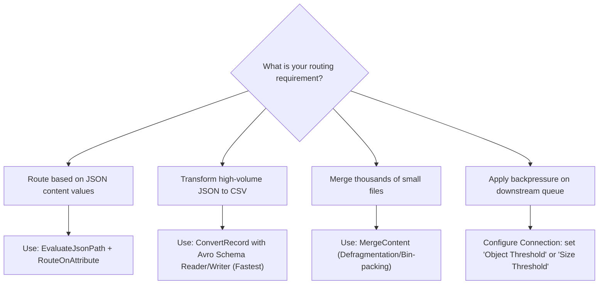
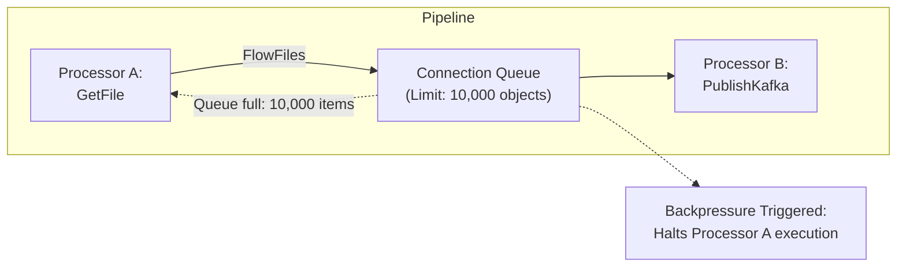
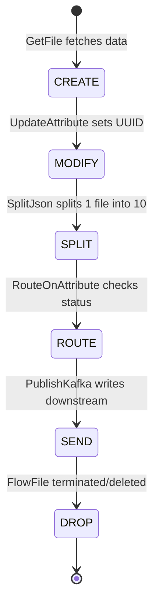
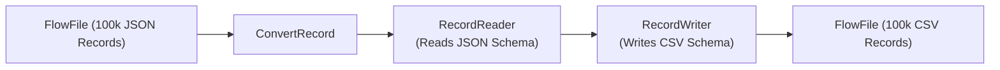

# 📘 Apache NiFi (Data Ingestion & Routing) - Complete 101 Guide

> A premium, comprehensive reference guide covering Apache NiFi's Flow-Based Programming model, FlowFile attributes and content partitions, internal repository architectures (FlowFile, Content, Provenance), record-oriented processing schemas, and SDE2-level interview preparation.

---

## 📚 Table of Contents

- [🎴 Quick Reference Card](#-quick-reference-card)
- [🎯 The 20% You Need 80% of the Time](#-the-20-you-need-80-of-the-time)
- [💡 Introduction & Overview](#-introduction--overview)
- [🧩 Core Concepts & NiFi Internals](#-core-concepts--nifi-internals)
- [🖼️ Visual Explanations (Mermaid)](#-visual-explanations-mermaid)
- [📖 Topic-Specific Deep Dives](#-topic-specific-deep-dives)
  - [Backpressure & Flow Control](#1-backpressure--flow-control)
  - [Record-Oriented Processing](#2-record-oriented-processing)
  - [Data Provenance & Lineage](#3-data-provenance--lineage)
- [⚖️ Trade-offs & Comparisons](#-trade-offs--comparisons)
- [📊 Practical Flow Patterns](#-practical-flow-patterns)
- [⚠️ Common Pitfalls & Anti-patterns](#-common-pitfalls--anti-patterns)
- [🔧 Troubleshooting & Production Gotchas](#-troubleshooting--production-gotchas)
- [💼 Interview FAQs (20 Questions)](#-interview-faqs-20-questions)
- [🔗 Related Topics](#-related-topics)

---

## 🎴 Quick Reference Card

| Aspect | Details |
| :--- | :--- |
| **What is NiFi?** | A high-performance, real-time data ingestion, routing, and transformation system designed around the principles of **Flow-Based Programming** (FBP) with an interactive drag-and-drop web UI. |
| **Why Use It?** | Visual pipeline auditing, native data buffering and backpressure, real-time message routing, comprehensive data lineage (provenance), and high extensibility. |
| **When to Use?** | Pulling data from edge devices/SFTP/REST APIs, routing and distribution of heterogeneous data, CDC ingestion into data lakes, and pre-buffering streams before Kafka queues. |

**Key Takeaway**: Apache NiFi excels at **data routing, consolidation, and ingestion** (the "Logistics" of data), but is not designed for heavy analytical processing (ETL transformations), which should be offloaded to engines like Apache Spark.

---

## 🎯 The 20% You Need 80% of the Time

### Critical Concepts (Master These First)

1. **FlowFile (The Data Packet)**: The atomic unit of data in NiFi. A FlowFile is divided into two distinct components:
   - **Attributes**: In-memory key-value metadata (e.g. filename, uuid, ingest timestamp).
   - **Content**: The actual data payload bytes. Content is never loaded into JVM memory; it is streamed directly from disk repositories.
2. **Processors & Execution**: Processors perform the actual work (e.g. `GetFile`, `PublishKafka`, `RouteOnAttribute`). They are fully asynchronous, utilizing a shared thread pool.
3. **Connections & Backpressure**: Bounded queues linking processors. When downstream queues fill up, NiFi automatically applies **Backpressure** to pause upstream processors, preventing system-wide Out of Memory (OOM) failures.

### Daily-Use Processors

- **Ingestion**: `GetFile`, `GetFTP`, `ConsumeKafka`, `ListenHTTP`, `QueryDatabaseTable`.
- **Routing**: `RouteOnAttribute`, `RouteOnContent`, `ControlRate` (throttling).
- **Transformation**: `UpdateAttribute`, `EvaluateJsonPath`, `ReplaceText`, `JoltTransformJSON`.
- **Record-Based (High Performance)**: `ConvertRecord`, `QueryRecord`, `PublishKafkaRecord`.
- **Egress**: `PutFile`, `PutS3Object`, `PublishKafka`, `PutSQL`.

### Quick Decision Tree



---

## 💡 Introduction & Overview

### What is Apache NiFi?

Apache NiFi is a real-time data logistics system developed by the NSA and open-sourced in 2014. It is designed to automate the flow of data between diverse systems, supporting highly configuration-driven, robust, and secure data pipelines.

### Why Does It Matter?

- **Native Backpressure**: Prevents fast producers from overwhelming slow consumers by automatically pausing upstream queues.
- **Full Data Lineage**: Tracks the history, transformation, and split/merge operations of every byte passing through the system, enabling auditable data compliance.
- **Hot-Swap Flow Editing**: Flows can be modified, started, stopped, and reconfigured in real-time through the visual UI without restarting the cluster.

---

## 🧩 Core Concepts & NiFi Internals

### NiFi anatomy: Repositories & Engine Internals

NiFi's performance relies on three distinct local database repositories on disk, decoupling metadata processing from raw I/O:

```text
Host Local Disk
├── FlowFile Repository      # Transactional journal tracking FlowFile states
├── Content Repository       # Append-only block storage for raw byte payloads
└── Provenance Repository    # Persistent log tracking history and lineage
```

#### 1. FlowFile Repository (State Journal)
- **Concept**: A highly optimized write-ahead log (journal) stored on disk. It tracks the active state, location, and key-value **Attributes** of every active FlowFile currently in flight within the JVM.
- **Aesthetic Performance**: If NiFi restarts unexpectedly, it reads this repository to instantly restore the flow state without losing data.

#### 2. Content Repository (Immutability & Block Storage)
- **Concept**: The physical home of all raw FlowFile byte payloads. To avoid memory bottlenecks, NiFi stores contents in append-only files on disk.
- **Copy-on-Write Immutability**: When a processor modifies a FlowFile (e.g. replacing a string), NiFi does not overwrite the existing data blocks. It writes the new payload to a new disk sector and updates the FlowFile's pointer. This prevents corruption, enables instant rollback, and allows concurrent processors to read the same content without locks.

#### 3. Provenance Repository (Data Lineage Log)
- **Concept**: A permanent history database that records a snapshot of every FlowFile event (creation, updates, splits, routing, drops).
- **Auditability**: Enables developers to search historical event timelines, inspect exact content payloads at specific steps, and replay failed runs.

---

### Clustering & High Availability

NiFi clusters utilize a **Zero-Master Clustering** architecture:
- All nodes in a cluster run the exact same flow configuration.
- **Cluster Coordinator**: Elected automatically via Apache ZooKeeper. Handles node heartbeat monitoring and distributes flow configurations to all nodes.
- **Primary Node**: A single elected node responsible for running processors configured to execute on "Primary Node Only" (typically ingestion processors like `GetFile` to prevent multiple nodes from consuming duplicate files).

---

## 🖼️ Visual Explanations (Mermaid)

### 1. NiFi Component Flow & Backpressure

This diagram illustrates how FlowFiles move between processors through connections, and how backpressure halts upstream operations when queues fill up:



---

### 2. Repository Architecture (How Data is Stored)

This diagram shows the physical separation between attributes (metadata) in the FlowFile Repository and the raw payload bytes in the Content Repository:

```mermaid
flowchart TD
  subgraph JVM_Memory ["JVM Memory"]
    FF_Obj["FlowFile Object Pointer<br>(State & Attributes only)"]
  end

  subgraph FlowFile_Repo ["FlowFile Repository (Disk)"]
    FF_Repo["Write-Ahead Log<br>(Attributes: uuid, filename, size)"]
  end

  subgraph Content_Repo ["Content Repository (Disk)"]
    Content_Repo["Physical Byte Blocks<br>(Immutability, Copy-On-Write)"]
  end

  FF_Obj -->|JSON Attributes| FF_Repo
  FF_Obj -->|Content Reference Pointer| Content_Repo

  style FF_Obj fill:#818cf8,stroke:#4f46e5,stroke-width:2px,color:#fff
  style FF_Repo fill:#34d399,stroke:#059669,stroke-width:2px,color:#fff
  style Content_Repo fill:#fbbf24,stroke:#d97706,stroke-width:2px,color:#fff
```

---

### 3. Data Lineage & Provenance Lifecycle

Tracing a FlowFile's lifecycle as tracked by the Provenance Repository:



---

## 📖 Topic-Specific Deep Dives

### 1. Backpressure & Flow Control

Backpressure is configured individually on each Connection (queue) between processors:
- **Object Threshold**: The maximum number of FlowFiles that can sit in the queue before backpressure is triggered (default: `10,000` files).
- **Size Threshold**: The maximum aggregate size of FlowFiles that can sit in the queue before backpressure is triggered (default: `1 GB`).

#### Backpressure Mechanism
1. When either threshold is met, the Connection is marked as full.
2. The scheduler stops assigning threads to the upstream processor, preventing it from producing more data.
3. The upstream processor remains paused until the downstream processor consumes enough FlowFiles to drop the queue below the backpressure threshold.

---

### 2. Record-Oriented Processing

> [!IMPORTANT]
> Traditional processors (like `SplitJson` followed by `EvaluateJsonPath`) require parsing, modifying, and committing individual FlowFiles to disk. For high-volume pipelines, this creates massive disk I/O bottlenecks.

**Record-Oriented Processors** (e.g. `ConvertRecord`, `QueryRecord`) resolve this by streaming batches of records through a single FlowFile using defined schemas:



- **Mechanism**: Reads the incoming FlowFile as a stream of records (using a `RecordReader` configured with an Avro, JSON, or CSV schema) and writes them out (using a `RecordWriter`) in a single pass without splitting the FlowFile.
- **Performance Benefit**: Reduces disk write operations by $99\%$, allowing NiFi to process millions of records per second.

---

### 3. Data Provenance & Lineage

The Provenance Repository tracks every action performed on a FlowFile:
- **Events Tracked**: `CREATE`, `FETCH`, `RECEIVE`, `CONTENT_MODIFIED`, `ATTRIBUTES_MODIFIED`, `ROUTE`, `SPLIT`, `JOIN`, `SEND`, `DROP`.
- **Searchable Metadata**: You can query the Provenance database by `uuid`, `filename`, or custom attributes to track down when and why a specific record failed.
- **Replay Capability**: If a downstream database write fails, you can locate the last successful processing event in the Provenance UI and click **Replay** to re-inject that FlowFile back into the pipeline.

---

## ⚖️ Trade-offs & Comparisons

### Apache NiFi vs. Apache Airflow

| Feature | Apache NiFi | Apache Airflow |
| :--- | :--- | :--- |
| **Primary Focus** | Real-time **Data Ingestion & Routing** (Flow). | Batch **Workflow Orchestration** (Jobs). |
| **Execution Model** | Continuous stream processing. | Scheduled task execution (cron/intervals). |
| **GUI Support** | Interactive visual drag-and-drop editor. | Code-defined DAGs (visualized read-only). |
| **Transformation Fit**| Low. Only lightweight routing & conversions. | High. Orchestrates Spark/Snowflake SQL tasks. |

---

### Apache NiFi vs. Kafka Connect

| Aspect | Apache NiFi | Kafka Connect |
| :--- | :--- | :--- |
| **Focus** | Multi-hop routing and ingestion across diverse systems. | Dedicated ingestion/egress for Kafka brokers. |
| **Visual Tooling** | Rich interactive canvas. | Configuration files (JSON/properties). |
| **Extensibility** | Supports 300+ processors out of the box. | Optimized for specific source/sink connectors. |
| **Cluster Topology** | Independent cluster deployment. | Can run directly on Kafka clusters. |

---

## 📊 Practical Flow Patterns

### 1. Ingestion Flow: File system to Kafka Queue
A common ingestion pattern that reads local files and streams them to a Kafka topic:

```text
[GetFile] 
   │
   ▼ (success)
[UpdateAttribute] ➔ Adds custom attributes (e.g. schema.name = 'orders')
   │
   ▼ (success)
[PublishKafka_2_6] ➔ Publishes FlowFile content to Kafka topic
```

---

### 2. JSON to CSV Conversion Pattern using Record Controllers
High-performance schema transformation flow:

```text
Processor: ConvertRecord
├─ Record Reader: JsonTreeReader  (Parses JSON content using Avro Schema Registry)
└─ Record Writer: CSVRecordSetWriter (Streams output as formatted CSV)
```

**Avro Schema definition** referenced by both controllers:
```json
{
  "type": "record",
  "name": "OrderRecord",
  "fields": [
    { "name": "order_id", "type": "string" },
    { "name": "customer_id", "type": "string" },
    { "name": "amount", "type": "double" }
  ]
}
```

---

## ⚠️ Common Pitfalls & Anti-patterns

### 1. Splitting High-Volume Files into Millions of Micro-FlowFiles

> [!WARNING]
> Using processors like `SplitJson` or `SplitText` to process huge files creates millions of individual FlowFile objects, overwhelming the JVM garbage collector and bloating the FlowFile Repository write-ahead log.

#### ❌ Anti-pattern (Creating millions of individual files)
```text
[GetFile] (1GB JSON) ➔ [SplitJson] ➔ Creates 1,000,000 FlowFiles ➔ [EvaluateJsonPath] (1,000,000 JVM pointer objects)
```

#### ✅ Best Practice (Stream-based Record processing)
```text
[GetFile] (1GB JSON) ➔ [QueryRecord] (Streams using JsonReader/CSVWriter in a single pass)
```

---

### 2. Treating NiFi as a Heavy Analytical Engine (ETL)

> [!IMPORTANT]
> Doing complex calculations, joins, and aggregations inside NiFi degrades cluster performance. NiFi is designed to route and ingest data, not process it.

#### ❌ Anti-pattern (Doing heavy transformations in NiFi)
- Using multiple chained `ReplaceText`, `ExecuteScript` (running heavy Python/Groovy code), and SQL joins.

#### ✅ Best Practice (Offloading transformations to Spark/Flink)
- Use NiFi to land raw JSON/CSV data in S3/HDFS, then trigger a Spark or Trino job to handle heavy transformations.

---

### 3. Using a Single Flat Canvas

#### ❌ Anti-pattern (Messy, unreadable flows)
- Dragging 200 processors onto the main canvas, creating a messy, unmaintainable "spaghetti flow".

#### ✅ Best Practice (Hierarchical Process Groups)
- Group related processors into **Process Groups** (e.g., `Ingest`, `Process`, `Egress`), similar to folders in a file system. Use **NiFi Registry** for version control.

---

## 🔧 Troubleshooting & Production Gotchas

### 1. Handling Disk Out of Space (Content Repository Exhaustion)
If the Content Repository disk fills up, NiFi's storage layer stalls, freezing all active processor threads.

#### Root Causes
- High data volume exceeding disk storage capacity.
- Downstream backpressure is disabled or set too high, allowing data to accumulate in queues.
- Short data retention times (`nifi.content.repository.archive.max.retention.period`) conflict with high ingestion rates.

#### Resolution
1. Set strict backpressure limits on all Connections to pause ingestion when downstream systems stall.
2. Configure NiFi's archiver settings in `nifi.properties` to purge old archived files aggressively:
   ```properties
   nifi.content.repository.archive.max.usage.percentage=80
   nifi.content.repository.archive.max.retention.period=12 hours
   ```

---

### 2. Resolving "Out of Memory" (JVM Garbage Collection pauses)
Occurs when too many FlowFile objects are loaded in JVM memory at once.

#### Resolution
- Increase JVM Heap allocation in `conf/bootstrap.conf`:
  ```properties
  # Set heap allocation based on system memory (e.g., 8GB heap)
  java.arg.2=-Xms8g
  java.arg.3=-Xmx8g
  ```
- Identify and eliminate `SplitJSON` or `SplitText` processors running on large files, replacing them with record-oriented processors.

---

## 💼 Interview FAQs (20 Questions)

### Basic Questions (Q1-Q10)

**Q1: What is Apache NiFi and what is its primary use case?**
> Apache NiFi is a real-time data logistics and routing system based on Flow-Based Programming. 
> - **Primary Use Case**: Data ingestion, routing, transformation, and delivery across diverse environments (e.g. edge-to-core, databases to cloud storage, REST APIs to Kafka).

**Q2: What is a FlowFile in NiFi? Describe its two main components.**
> A FlowFile is the atomic unit of data moving through a NiFi pipeline. It consists of:
> 1. **Attributes**: In-memory key-value metadata (e.g., file size, UUID, filename).
> 2. **Content**: The physical byte payload stored on disk in the Content Repository.
> > Decoupling attributes from content allows NiFi to route files instantly using metadata without reading or loading large payloads into memory.

**Q3: What are the three primary disk repositories in Apache NiFi?**
> - **FlowFile Repository**: Stores active FlowFile states and attributes in a transactional write-ahead log.
> - **Content Repository**: Stores raw byte payloads using append-only block storage.
> - **Provenance Repository**: Logs the history and lineage events of every FlowFile passing through the system.

**Q4: What is Backpressure in NiFi and how is it configured?**
> Backpressure is a flow-control mechanism configured on Connections to prevent fast producers from overwhelming slow downstream consumers.
> - **Configuration**:
>   - **Object Threshold**: Pause upstream when queue count exceeds a limit (e.g. `10,000` files).
>   - **Size Threshold**: Pause upstream when queue size exceeds a limit (e.g. `1 GB`).

**Q5: What is a Controller Service in Apache NiFi?**
> A Controller Service is a shared configuration component shared across processors (e.g., database connection pools, SSL contexts, schema registries). They are configured at the parent process group level and activated globally.

**Q6: What is a Process Group and why is it used?**
> A Process Group is a logical container that groups related processors and connections into a single hierarchical component, acting like a folder.
> - **Why used**: Simplifies canvas layout, promotes code reuse, and enables team collaboration and version control via the NiFi Registry.

**Q7: Explain the function of the "Primary Node" in a NiFi Cluster.**
> In a NiFi cluster, the Primary Node is the single node elected to run processors configured to execute on "Primary Node Only".
> - **Use Case**: Ingestion processors (like `GetFile` or `GetFTP`) are run on the Primary Node Only to prevent multiple nodes from consuming duplicate files from the same source.

**Q8: What is the NiFi Registry?**
> The NiFi Registry is a companion application that provides version control, lifecycle management, and CI/CD deployment capabilities for NiFi flows, allowing teams to track changes and roll back flow configurations.

**Q9: What are FlowFile Attributes and how do processors query them?**
> Attributes are key-value metadata associated with a FlowFile. Processors query and manipulate them using **NiFi Expression Language (EL)** (e.g. `${filename:substringBefore('.')}`).

**Q10: What does the `MergeContent` processor do?**
> `MergeContent` consolidates many small FlowFiles into a single large FlowFile (using formats like ZIP, Tar, or Avro), which is a crucial step for preventing the "small files problem" before landing data in HDFS or S3.

---

### Advanced Questions (Q11-Q20)

**Q11: Explain the internal repository architecture of NiFi. How does it maintain high throughput and data integrity?**
> NiFi decouples metadata from physical data writes to maintain high performance:
> 1. The **FlowFile Repository** uses a transactional write-ahead log. Attributes are cached in memory for fast lookup, and state updates are written sequentially to disk.
> 2. The **Content Repository** uses copy-on-write immutability. Raw byte payloads are written sequentially to disk. If a processor modifies the payload, NiFi writes the new payload to a new sector, preventing write locks.
> 3. The **Provenance Repository** logs lineage events asynchronously to prevent I/O operations from blocking active processing threads.

**Q12: Why are record-oriented processors superior to split-based processors for high-throughput pipelines?**
> - **Split-based (`SplitJson` / `SplitText`)**: Creates individual FlowFile objects for each record in a dataset. Splitting a 1M record JSON file creates 1M new database logs in the FlowFile Repository, which causes high disk I/O and garbage collection bottlenecks.
> - **Record-oriented (`ConvertRecord` / `QueryRecord`)**: Streams the file as a continuous record stream using schema registries. The entire operation is executed in a single pass over a single FlowFile, reducing repository updates and memory usage by $99\%$.

**Q13: How does NiFi clustering coordinate flow state? Describe the roles of the Coordinator and ZooKeeper.**
> NiFi uses a Zero-Master coordination model:
> 1. **Apache ZooKeeper** manages broker coordination and elects the **Cluster Coordinator** and **Primary Node**.
> 2. When a node joins, it requests the master flow configuration (`flow.xml.gz`) from the Cluster Coordinator.
> 3. The Coordinator ensures all nodes run the exact same flow. If a developer modifies a flow on one node, the coordinator distributes the update to all active nodes simultaneously.

**Q14: Explain the Data Provenance Repository and how it facilitates production debugging.**
> The Provenance Repository tracks and logs every event in a FlowFile's lifecycle:
> - **Lineage Search**: You can search history by `uuid` or `filename` to view the exact path a FlowFile took through the system.
> - **Content Inspection**: Allows developers to view the exact state of the payload before and after any processing step.
> - **Replay**: If a downstream database write fails, you can select the last successful step in the Provenance UI and replay the FlowFile to re-run the pipeline.

**Q15: What is the "Zero-Copy" or copy-on-write performance optimization in NiFi's Content Repository?**
> When a FlowFile moves between processors without modifying its payload (e.g. routing, attribute updates), NiFi simply copies the in-memory pointer referencing the payload in the Content Repository. The actual data bytes on disk are never copied or moved, enabling high-performance routing.

**Q16: How do you configure and secure NiFi's Site-to-Site (S2S) communications?**
> Site-to-Site (S2S) is a high-performance protocol used to transfer data between distinct NiFi clusters:
> - **Setup**: Configure Input and Output Ports on the target canvas.
> - **Security**: Enforce mutually authenticated TLS (mTLS) using client certificates. The target cluster's keystore must trust the source cluster's certificate, and S2S access permissions must be explicitly granted in the NiFi policies.

**Q17: Describe a scenario where a NiFi cluster experiences FlowFile Repository corruption. How do you recover?**
> Corruption can occur due to sudden power loss or disk exhaustion:
> - **Recovery**:
>   1. Stop NiFi.
>   2. Run NiFi's repository repair tool (`bin/nifi.sh repo-diagnostic`) to identify corrupted journal sectors.
>   3. If the journal is unrecoverable, you must clean the FlowFile Repository directory (`/var/lib/nifi/flowfile_repository`).
>   - *Note*: Deleting the journal restores the flow structure but drops active in-flight FlowFiles. Data is recovered by replaying source files or re-ingesting events.

**Q18: How do you manage schemas dynamically in NiFi using the Hortonworks Schema Registry or NiFi's internal Avro Schema Registry?**
> 1. Define your schema in the **AvroSchemaRegistry** controller service using standard JSON formatting.
> 2. Configure record-oriented processors to lookup schemas by name (`schema.name` attribute).
> 3. Set the processor's **Schema Access Strategy** to `Use 'schema.name' Attribute`, enabling dynamic schema resolution.

**Q19: What is backpressure object threshold depletion and how does it cause cluster instability?**
> If backpressure thresholds are set too high (e.g. millions of objects) or disabled, slow downstream systems will cause FlowFiles to pile up in queues.
> - **Instability**: The FlowFile Repository write-ahead log will bloat, consuming disk space and causing high JVM garbage collection pauses, which can lead to Out of Memory (OOM) failures.

**Q20: How do you implement custom processors in Apache NiFi using Java?**
> 1. Create a Maven project using the `nifi-processor-bundle-archetype`.
> 2. Extend the `AbstractProcessor` class.
> 3. Define properties and relationships using `@CapabilityDescription` and `@Tags` annotations.
> 4. Override the `onTrigger()` method to read, process, and write FlowFile contents using the `ProcessSession` API.
> 5. Build and package the project as a **NAR (NiFi Archive)** file and place it in NiFi's `lib/` directory.

---

## 🔗 Related Topics

- [Apache Kafka Ingestion Systems](../06-kafka/kafka-notes.md)
- [Airflow Pipeline Orchestration](../07-airflow-and-orchestration/airflow-and-orchestration-notes.md)
- [Data Platform Architecture](../14-data-platform-architecture/data-platform-architecture-notes.md)

---

*Last updated: May 2026*
