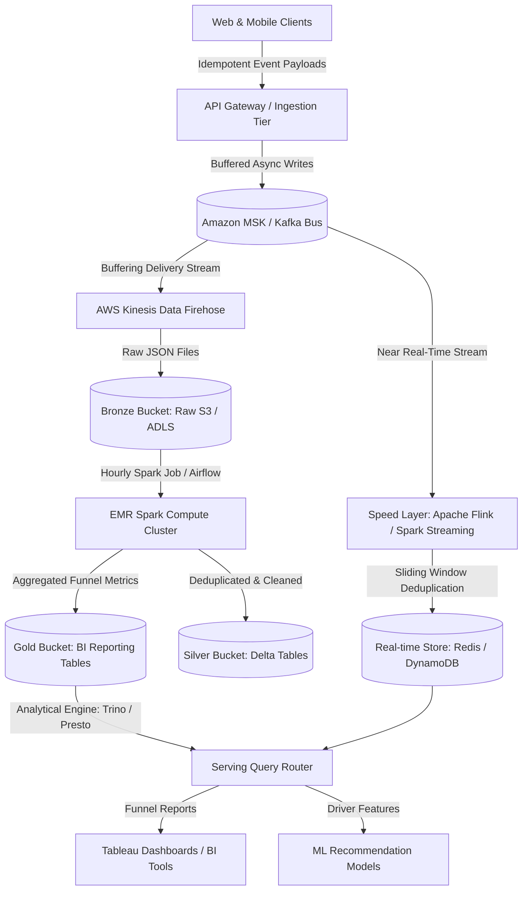
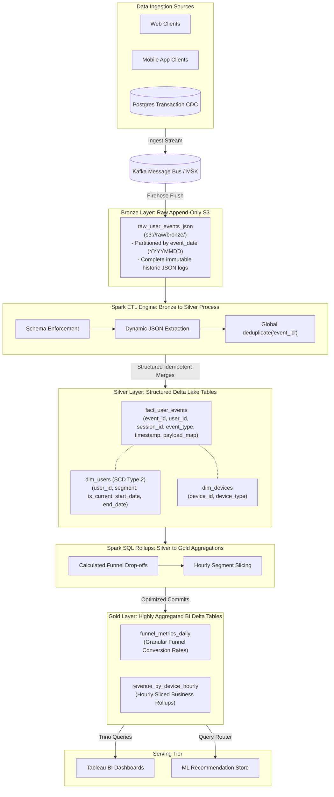

# 🧪 Case Study: Big Data System Design — E-Commerce User Activity Tracker

> Detailed architecture for a high-volume, data-intensive event tracking system, designed to handle hundreds of millions of events daily with mixed real-time and analytical query SLAs. Based on the 6-Step Data Engineering System Design Framework.

---

## 🗺️ The 6-Step Data Engineering Framework

In data engineering system design interviews, candidates often fail not due to a lack of knowledge, but because they rush to draw boxes and struggle with ambiguity. Every data-intensive architecture (e.g., e-commerce lakehouses, recommendations, fraud pipelines) can be systematically resolved using this six-step framework:

```
┌─────────────────────────────────────────────────────────────────────────┐
│                    THE 6-STEP DATA ENGINEERING FRAMEWORK                │
├─────────────────────────────────────────────────────────────────────────┤
│  1. Requirements Gathering (Functional: Who/What/How | Non-Functional)  │
│  2. Pipeline Design (Batch vs. Stream | Lambda vs. Kappa vs. Lakehouse) │
│  3. Data Modeling (Bronze/Silver/Gold | Star/Snowflake | SCD 1/2/3)      │
│  4. Storage & File Formats (Parquet/Delta/Iceberg | Partition/Clustering)│
│  5. Data Quality & Observability (SLA alerts | Testing | Monitoring)     │
│  6. Scalability, Backfills & Data Ops (10x Load | Idempotency | Salting)│
└─────────────────────────────────────────────────────────────────────────┘
```

---

## Step 1: Requirements Gathering & Scope

Always spend the first 5 minutes gathering functional and non-functional requirements instead of jumping straight to drawing boxes.

### A. Functional Requirements (The "Who", "What", and "How")
* **Who is the user?** 
  * *Marketing Analysts* querying page-behavioral trends and user flows.
  * *Machine Learning (ML) Team* feeding downstream product recommendation models.
* **What do they need?**
  * Marketing needs **Conversion Funnel Metrics** representing user drop-offs across key stages:
    `Homepage` ➔ `Search Product` ➔ `View Product` ➔ `Add to Cart` ➔ `Purchase`
  * They must slice and dice these funnel stages by dimensions:
    * **User Segment**: User type (new vs. returning, free vs. paid).
    * **Device Type**: Device (desktop vs. mobile).
      * *Example Business Value*: Analyzing if a Desktop checkout flow is broken (e.g., a $2\%$ Desktop conversion rate vs. a $6\%$ Mobile conversion rate).
  * Downstream ML models need raw event feeds.
* **How are they accessing it?**
  * Marketing queries highly aggregated metrics through **Tableau BI dashboards**.
  * ML models consume features from an online, low-latency key-value store.

### B. Non-Functional Requirements
* **Data Freshness SLAs**:
  * *Scenario A (Marketing BI)*: Refresh latency of $1$ hour is completely acceptable.
  * *Scenario B (ML Recommendation)*: Stream latency of $< 1$ minute (or seconds) is required.
* **Volume**: Massive petabyte-scale potential. Must calculate back-of-the-envelope size.
* **Availability**: High-availability ingestion tier ($99.99\%$ uptime) to prevent event loss.
* **Data Retention**: $12$ months of active retention in the bronze layer, with old data moved to an archive layer to optimize storage cost.

---

## Step 2: Back-of-the-Envelope Estimation

Always validate your choice of tools (e.g., Spark vs. single-node Pandas/Polars) using simple math.

### A. Traffic & Event Math
* **Daily Active Users (DAU)**: $5,000,000$ (5 Million)
* **Average Sessions per User / Day**: $2$
* **Events per Session**: $30$ (clicks, scrolls, searches, purchases)
* **Total Daily Events**:
  $$ 5,000,000 \text{ DAU} \times 2 \text{ sessions} \times 30 \text{ events} = 300,000,000 \text{ (300 Million) events/day} $$
* **Average Ingest QPS**:
  $$ 300,000,000 \text{ events} / 86,400 \text{ seconds} \approx 3,472 \text{ events/sec (EPS)} $$
* **Peak QPS (Assuming } 3\times \text{ average peak)**:
  $$ 3,472 \times 3 \approx 10,416 \text{ EPS} $$

### B. Storage & Cost Math
* **Average Event Size**: $700 \text{ bytes}$ (user ID, session ID, timestamp, dynamic JSON payload).
* **Daily Raw Data Volume**:
  $$ 300,000,000 \text{ events} \times 700 \text{ bytes} \approx 210 \text{ GB/day} $$
* **Monthly Raw Data Volume**:
  $$ 210 \text{ GB/day} \times 30 \approx 6.3 \text{ TB/month} $$
* **Annual Raw Data Volume**:
  $$ 6.3 \text{ TB/month} \times 12 \approx 75 \text{ TB/year} \text{ (before compression)} $$
* **Compressed Volume (Parquet/Delta)**: Columnar compression (Parquet with Snappy) provides $2\text{-}5\times$ compression:
  $$ 75 \text{ TB} / 3.5 \approx 21.4 \text{ TB/year} \text{ (easily manageable on S3/ADLS)} $$

### C. Design Decisions Driven by Numbers
* **Compute Engine**: Single-node tools like **Pandas** or **Polars** are ruled out due to processing 210 GB/day. We must use distributed compute (**Apache Spark**).
* **Ingestion SLA**: Since $1$ hour latency is fine for the marketing team, we do not need complex real-time streaming architectures (Kafka/Flink) for Scenario A. A batch pipeline running every hour via **Airflow** is completely sufficient and highly cost-effective.
* **Storage Partitioning**: To prevent hourly Spark batch jobs from scanning the entire historical dataset, we partition raw ingestion files by `event_date` (`YYYYMMDD`).

---

## Step 3: Pipeline & Architecture Design



### A. Lambda vs. Kappa vs. Lakehouse Architectures

#### 1. Lambda Architecture (Dual-Path)
* **Batch Layer**: Processes large historical datasets stored in raw buckets for absolute correctness.
* **Speed Layer**: Handles real-time events as they arrive, serving queries with low latency.
* **Serving Layer**: Merges query signals from both paths to provide an accurate, up-to-the-minute view.
* *Trade-off*: High operational complexity since engineers must write and maintain two independent code bases (e.g., Flink for streaming, Spark for batch).

#### 2. Kappa Architecture (Single Stream-Path)
* Removes the batch layer entirely. Every event flows through a single streaming pipeline, using **Kafka as Storage** with extended retention periods (e.g., 30 days).
* *Re-processing*: To change logic, spin up a new consumer group, point the offset to `today - 2 weeks`, replay events, and swap output pointers when caught up.
* *Trade-off*: Extremely expensive to store long histories in Kafka. Replaying millions of historic records through a stream processor is far slower than running standard parallel Spark batch jobs.

#### 3. The Unified Lakehouse (Modern Industry Solution)
* Ingests streaming events into Kafka, but continually flushes raw data into object storage (S3/ADLS).
* Batch processing relies on Spark running on object store Delta tables, while Flink serves real-time caches.

---

## Step 4: Data Modeling (Medallion Architecture)

Avoid simply drawing tables; organize data using the structured **Medallion Layers** and define your dimensional structures explicitly.

```
 s3://raw/bronze/  ➔  s3://cleaned/silver/  ➔  s3://aggregates/gold/
 (Append-Only JSON)    (Deduplicated Columns)   (BI Optimized Tables)
```



### A. Medallion Layers
1. **Bronze Layer (Raw Event Storage)**:
   * Direct append-only raw JSON dump from Kinesis Data Firehose.
   * Preserves the exact structural payload as produced.
2. **Silver Layer (Cleaned & Modeled Core)**:
   * Read from Bronze, perform schema enforcement, and parse dynamic JSON payloads into structured columns.
   * Conduct global deduplication using event IDs.
   * Users and sessions are structured into core **Fact and Dimension Tables**.
3. **Gold Layer (Aggregated Metrics)**:
   * Hourly rollup tables that compute e-commerce funnel stage percentages (e.g., page views, add-to-carts, purchase rates).
   * Pre-segmented by `user_type` and `device_type` for ultra-fast Tableau query performance.

### B. Star Schema & Slowly Changing Dimensions (SCD)
* Keep data modeling in the Silver layer structured as a **Star Schema** with high-performance Fact tables referencing Dimension tables.
* **SCD Type 2**: User segment dimensions (e.g., new vs. returning, free vs. paid) change over time. We employ SCD Type 2 (using `start_date`, `end_date`, and `is_current` boolean flags) to preserve precise historical context for users when conversion actions occur.

---

## Step 5: Storage and File Formats

Storage decisions have a massive impact on read performance and cloud infrastructure costs.

### A. Columnar Delta Format
* We save data using the **Delta Lake** (or Apache Iceberg) file format on S3.
* Leverages columnar storage with Snappy compression, enabling query engines to skip unread columns completely.

### B. Partitioning vs. Liquid Clustering

#### ❌ The Hard Partitioning Problem
Partitioning by granular folders (e.g., `/year/month/day/hour/`) leads to the **Small File Problem** if sub-categories are sparse. The query engine must crawl thousands of tiny metadata files, causing high latency.

#### ✅ The Modern Solution: Liquid Clustering
Instead of hard folder partitions, we use **Delta Lake Liquid Clustering** (or Iceberg Z-Ordering). 
* Files are clustered dynamically on critical query dimensions (e.g., `user_id`, `event_type`, `category`).
* The analytical engine (**Trino**) uses internal file min/max index statistics to prune unnecessary objects instantly, avoiding expensive full table scans.

---

## Step 6: Data Quality, Observability & Data Ops

How do we establish trust in our pipeline output?

### A. Data Quality Rules & SLAs
* **Schema Validation**: Reject payloads with missing mandatory fields (e.g., missing `event_id` or `timestamp`) and route them to a Dead-Letter Queue (DLQ) for debugging.
* **Freshness Monitors**: Trigger critical alerts if the latency between `event_timestamp` and the gold layer's write commit exceeds $15$ minutes.

### B. Scalability: Handling Key Skew via Salting
During high-traffic events (e.g., Black Friday), a single hot item or popular seller will generate millions of clicks. In Kafka/Spark, partitioning by `seller_id` will send all these events to one worker, overloading it while other cluster workers sit idle.
* **Salting Technique**: Append a random integer suffix (e.g., `0` to `9`) to the partition key during ingestion (e.g., `partition_key = seller_id + "_" + random(0, 9)`). This spreads the hot key's load uniformly across all partitions, balancing computing resources.

### C. Multi-Tier Deduplication Mechanics
To guarantee absolute correctness, deduplication is executed at multiple tiers of the pipeline:

```
[ Client App ]  ➔  [ API Gateway ]  ➔  [ Speed Stream ]  ➔  [ Batch Layer ]
(Idempotent UUID)  (Redis 5-min TTL)   (Flink Slide Window) (Spark dropDuplicates)
```

1. **At API Gateway (Rate Control)**: Clients generate an idempotent `event_id` (UUID4). The Gateway checks this key against a **Redis cache with a 5-minute TTL**. If a duplicate is received (due to double-clicks or client retries), it is discarded.
2. **In Speed Layer**: Flink utilizes a rolling window cache to filter duplicates in memory.
3. **In Batch Layer (Absolute Guarantee)**: During hourly EMR batch runs, Spark performs exact global deduplication:
   ```python
   # Spark Batch Deduplication
   deduplicated_df = raw_df.dropDuplicates(["event_id"])
   ```

### D. Pipeline Idempotency
Ensure that running the pipeline multiple times behaves consistently and does not corrupt state. We achieve this by utilizing Delta Lake's **atomic merge/overwrite** operations:
```sql
-- Atomic idempotent write ensuring retries don't double-append data
MERGE INTO silver_table AS target
USING hourly_incoming_stage AS source
ON target.event_id = source.event_id
WHEN NOT MATCHED THEN INSERT *;
```

---
*Last updated: May 2026*
