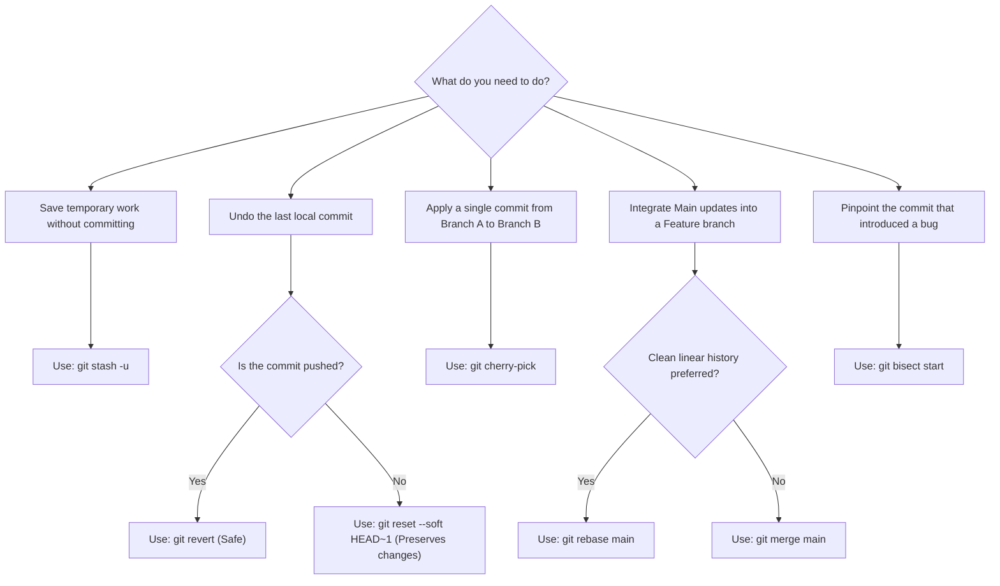
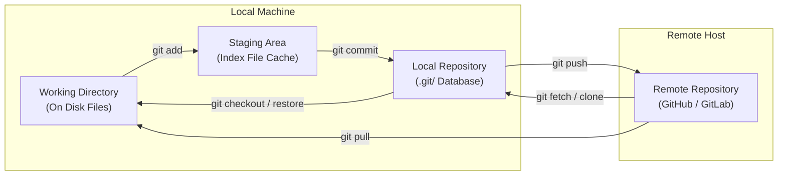
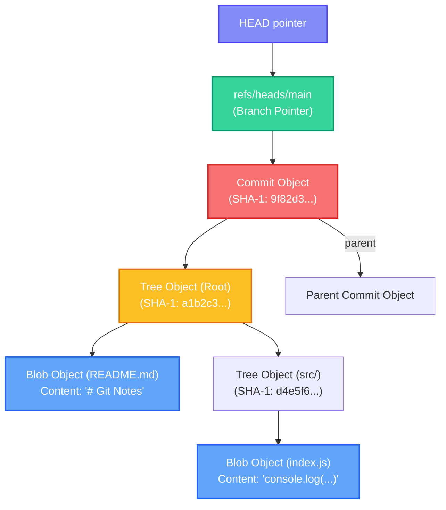
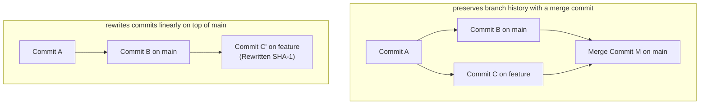

# 📘 Git (Distributed Version Control System) - Complete 101 Guide

> A premium, comprehensive reference guide covering Git's distributed architecture, low-level object model internals, branching workflows, naming conventions, cheat sheets, hands-on labs, troubleshooting guides, and SDE2-level interview preparation.

---

## 📚 Table of Contents

- [🎴 Quick Reference Card](#-quick-reference-card)
- [🎯 The 20% You Need 80% of the Time](#-the-20-you-need-80-of-the-time)
- [💡 Introduction & Overview](#-introduction--overview)
- [🧩 Core Concepts & Git Internals](#-core-concepts--git-internals)
- [🖼️ Visual Explanations (Mermaid)](#-visual-explanations-mermaid)
- [📖 Topic-Specific Deep Dives](#-topic-specific-deep-dives)
  - [Branching Strategies](#1-branching-strategies--workflows)
  - [Git Naming Conventions](#2-git-naming-conventions)
  - [Advanced Git Operations](#3-advanced-git-operations)
  - [Git Automation & Hooks](#4-git-automation-hooks)
- [⚖️ Trade-offs & Comparisons](#-trade-offs--comparisons)
- [📋 Cheat Sheet & Quick Reference](#-cheat-sheet--quick-reference)
- [🔬 Hands-on Practice Labs](#-hands-on-practice-labs)
- [⚠️ Common Pitfalls & Anti-patterns](#-common-pitfalls--anti-patterns)
- [🔧 Troubleshooting & Production Gotchas](#-troubleshooting--production-gotchas)
- [💼 Interview FAQs (30 Questions)](#-interview-faqs-30-questions)
- [🔗 Related Topics](#-related-topics)

---

## 🎴 Quick Reference Card

| Aspect | Details |
| :--- | :--- |
| **What is Git?** | A high-performance, distributed version control system (DVCS) designed to track source code changes locally and synchronize them across remote contributors. |
| **Why Use It?** | Native offline capabilities, instantaneous branching and merging, cryptographically secure history tracking (SHA-1/SHA-256), and high resilience against data corruption. |
| **When to Use?** | Standard default for modern software engineering, monorepos or polyrepos, continuous integration and delivery (CI/CD) pipelines, and declarative GitOps deployments. |

**Key Takeaway**: Git is a **Content-Addressable Storage** system that tracks snapshots of filesystem states, not delta differences. Understanding the local tree transitions (Working Directory ➔ Staging Area ➔ Local Repo) is the key to mastering Git.

---

## 🎯 The 20% You Need 80% of the Time

### Critical Concepts (Master These First)

1. **Staging Area & The Three Trees**: Git coordinates code changes across three distinct boundaries:
   - **Working Directory**: The actual files on your disk.
   - **Staging Index**: The preparation zone containing files proposed for the next commit.
   - **Local Repository**: The `.git` database containing committed snapshots pointed to by `HEAD`.
2. **Snapshots, Not Differences**: Unlike legacy version control tools (like SVN or CVS) that store file diffs, Git takes a complete **snapshot** of all tracked files at commit time. Unchanged files are stored as references pointing to existing files, making branch switching extremely fast.
3. **Fully Distributed Topology**: Every developer has a full clone of the repository history. There is no dependency on a central server for viewing logs, branching, or committing code.

### Daily-Use Commands

```bash
# 1. Clone a repository
git clone git@github.com:user/repo.git

# 2. Check status (short format)
git status -s

# 3. Interactive staging (stage specific hunks)
git add -p

# 4. Commit changes with a clean message
git commit -m "feat(auth): integrate OAuth2 Google provider"

# 5. Pull remote changes with automatic rebase (keeps history linear)
git pull --rebase origin main

# 6. Push local changes to remote
git push -u origin feature/user-auth

# 7. Modern branch switching
git switch -c feature/login     # Create and switch
git switch main                 # Switch to main

# 8. Stash current working directory changes (including untracked files)
git stash -u

# 9. Restore popped changes from stash
git stash pop

# 10. High-fidelity visual commit graph
git log --oneline --graph --all --decorate
```

### Quick Decision Tree



---

## 💡 Introduction & Overview

### What is Git?

Git is an open-source, distributed version control system designed by **Linus Torvalds** in 2005 to support the development of the Linux kernel. It is optimized for speed, data integrity, and support for distributed, non-linear workflows. 

Unlike Centralized Version Control Systems (CVCS) like Subversion (SVN) or Perforce, which store a master history on a single central server, Git grants every client a full backup of the entire repository history. 

### Why Does It Matter?

- **Zero-Latency Local Execution**: Since the entire project history lives on the developer's machine, operations like viewing history (`git log`), creating branches (`git branch`), and committing changes (`git commit`) happen instantaneously without network overhead.
- **Robust Branching & Merging**: Git branches are simply lightweight, mobile pointers to commit objects. Creating or deleting branches is a $O(1)$ pointer modification, encouraging short-lived feature isolation.
- **Cryptographic Integrity**: Every file, directory structure, commit, and tag in a Git database is hashed using a secure SHA-1 checksum (or SHA-256 in newer editions). It is impossible to alter code, commit messages, or file metadata in transit or storage without changing the hash, guaranteeing absolute history traceability.

---

## 🧩 Core Concepts & Git Internals

### Git low-level Internals: Content-Addressable Storage

At its heart, Git is a simple key-value database. The key is a **SHA-1 checksum** (a 40-character hexadecimal string representing the 160-bit hash of the stored object), and the value is the raw decompressed object payload. Git uses zlib compression to compress object content before writing it to disk.

There are four primary object types stored within the Git database (`.git/objects/`):

1. **Blob**: Stores raw file contents (code, binary files, text). A blob does not store file metadata, permissions, directory paths, or filenames—only the raw content bytes.
2. **Tree**: Represents a directory. A tree object links filenames, permissions, and directory paths to their respective blob hashes or nested tree hashes, mapping the exact structural directory tree layout.
3. **Commit**: Represents a snapshot of the repository. A commit object holds:
   - A pointer to the root **Tree** hash.
   - Pointers to zero, one, or more parent **Commit** hashes (enabling merge tracking).
   - Author and Committer names, emails, and timestamps.
   - The commit message.
4. **Annotated Tag**: A permanent pointer that references a specific commit, complete with the tagger's identity, timestamp, custom message, and an optional GPG signature.

---

### The `.git` Directory Layout

When you initialize a repository with `git init`, Git creates a `.git/` folder containing the following core elements:

```text
.git/
├── HEAD            # Reference pointer to the currently active branch/commit
├── config          # Repository-specific configuration options (remotes, settings)
├── description     # Default placeholder file used by Gitweb
├── hooks/          # Client-side hooks scripts (pre-commit, post-push, etc.)
├── index           # Binary index file containing the Staging Area status
├── info/
│   └── exclude     # Repository-specific gitignore rules (not committed to remote)
├── objects/        # The core Git object database (blobs, trees, commits, tags)
└── refs/           # Pointers to local branches, remote branches, and tags
    ├── heads/      # Local branch references (e.g. refs/heads/main)
    ├── tags/       # Tag reference files
    └── remotes/    # Remote tracking branch references
```

---

## 🖼️ Visual Explanations (Mermaid)

### 1. The Four Areas of Git Flow

This diagram illustrates how code transitions across different local zones and remote hosts:



---

### 2. Git Internals Object Model Graph

This diagram shows how Git represents the workspace under the hood. The `HEAD` pointer directs to a branch reference, which points to a **Commit** containing author details, pointing to a **Tree** directory layout, mapping filenames to **Blobs**:



---

### 3. Merge vs. Rebase Operations

Understanding the absolute history difference between `git merge` and `git rebase`:



---

## 📖 Topic-Specific Deep Dives

### 1. Branching Strategies & Workflows

Selecting the correct branching model is critical for matching shipping frequency with team size:

#### A. Git Flow (Scheduled Releases)
- **Concept**: A rigid, highly structured branching model. Dual long-lived branches exist: `main` (production-ready code) and `develop` (integration branch).
- **Short-lived branches**: `feature/*` (branched from `develop`), `release/*` (branched from `develop` to stabilize), and `hotfix/*` (branched from `main` to patch production regressions).
- **Best for**: Teams shipping versioned software (e.g. mobile apps, enterprise desktop packages) with scheduled release cycles.

#### B. GitHub Flow (Continuous Delivery)
- **Concept**: A lightweight, simple branching model. There are no development or release branches—only `main` and short-lived feature branches branched directly from `main`.
- **Workflow**: Create a branch, push commits, open a Pull Request (PR), conduct code reviews, test via CI, merge directly into `main`, and deploy immediately.
- **Best for**: Web applications, SaaS, and continuous deployment environments.

#### C. Trunk-Based Development (Continuous Integration)
- **Concept**: Developers merge small, frequent commits into a single central branch (the "trunk", typically `main`) multiple times a day. Feature branches are extremely short-lived (less than 24 hours).
- **Workflow**: Relies heavily on **Feature Flags** (toggles) to hide uncompleted features in production. Requires high test coverage CI pipelines to catch integrations early.
- **Best for**: High-performing engineering teams with mature CI/CD practices.

---

### 2. Git Naming Conventions

Enforcing strict naming conventions prevents clutter, simplifies automation scripts, and provides readable, self-documenting history.

#### A. Repository Naming Conventions
- **Standard**: Use **kebab-case** (lowercase, words separated by hyphens).
- **Format**: `[domain/prefix]-[project-name]-[suffix/language]` (optional).
- **Examples**:
  - `payment-gateway-service` (Service domain)
  - `admin-dashboard-frontend` (Frontend layer)
  - `infra-terraform-aws` (Infrastructure repository)

#### B. Branch Naming Conventions
- **Standard**: Use lowercase **kebab-case** prefixed with a category folder indicating purpose.
- **Hierarchical Prefixes**:
  - `feat/` — New feature development (e.g. `feat/user-login`)
  - `fix/` — Standard bug fix (e.g. `fix/password-reset-validation`)
  - `hotfix/` — Urgent production hotfix (e.g. `hotfix/stripe-webhook-500`)
  - `docs/` — Documentation updates (e.g. `docs/api-readme-setup`)
  - `refactor/` — Code improvement with no functional shifts (e.g. `refactor/db-connection-pool`)
  - `chore/` — Maintenance, dependency bumps, tooling updates (e.g. `chore/upgrade-react-v19`)
  - `test/` — Adding or correcting test suites (e.g. `test/e2e-payment-flow`)
- **Ticket Reference Binding**: If using Jira, Linear, or GitHub Issues, embed the ticket ID:
  - `feat/PROJ-1204-add-elastic-search`
  - `fix/BUG-99-resolve-memory-leak`

#### C. Commit Message Conventions (Conventional Commits)
Strictly follow the **Conventional Commits** specification. Commit messages must be structured as follows:

```text
<type>(<scope>): <subject>

[optional body]

[optional footer(s)]
```

##### 1. Core Commitment Types:
- `feat`: A new feature is introduced.
- `fix`: A bug fix is merged.
- `chore`: Modifying build processes, configurations, or dependencies (no source changes).
- `docs`: Documentation alterations.
- `style`: Changes that do not affect code logic (whitespace, linting, formatting).
- `refactor`: A code change that neither fixes a bug nor adds a feature.
- `perf`: Code changes focused purely on optimizing performance.
- `test`: Adding or correcting tests.
- `ci`: Modifying pipeline runners, scripts, or deployment structures (e.g. GitHub Actions).

##### 2. Breaking Changes:
Indicate breaking API or architectural changes by adding a `!` immediately after the type/scope, or placing `BREAKING CHANGE:` at the start of the footer.
- *Example*: `feat(api)!: drop support for v1 XML endpoints`

##### 3. Commit Message Rules:
- **Rule 1**: Use the **imperative, present-tense mood** (e.g. "add" instead of "added" or "adds"). Think of it as: *"If applied, this commit will..."*
- **Rule 2**: Limit the subject line to **50 characters** or fewer.
- **Rule 3**: Do not capitalize the first letter of the subject line, and **do not end with a period**.
- **Rule 4**: Separate the subject line from the body with a blank line. Limit body lines to **72 characters** for optimal git CLI rendering.

---

### 3. Advanced Git Operations

#### A. Cherry-pick (Porting Specific Commits)
Cherry-picking takes the patch from a single commit on another branch and applies it directly on top of your current `HEAD` commit as a new commit.

```bash
# Apply a specific commit
git cherry-pick 3fa871e

# Stage changes without committing (allows custom amends)
git cherry-pick -n 3fa871e
```

#### B. Interactive Rebase (History Rewriting)
Interactive rebase (`git rebase -i`) lets you rewrite, reorder, delete, squash, or split existing commits.

```bash
# Rewrite the last 4 commits on current branch
git rebase -i HEAD~4
```

This opens an editor with a list of commits prefixed with `pick`. You can modify the prefix action:
- `pick` (or `p`): Keep the commit as is.
- `reword` (or `r`): Keep the commit contents, but change the message.
- `edit` (or `e`): Pause the rebase to amend files/contents.
- `squash` (or `s`): Merge this commit's changes into the previous commit, combining messages.
- `fixup` (or `f`): Merge changes into the previous commit but discard this commit's message.
- `drop` (or `d`): Completely discard this commit.

#### C. Git Worktree (Concurrent Multi-Branch Workspaces)
Git worktrees allow you to check out multiple branches of a single repository simultaneously into separate directories on your disk. This is highly useful for debugging production hotfixes while keeping your main feature development intact without stashing.

```bash
# Add a new worktree in a sibling directory for hotfix work
git worktree add ../hotfix-login hotfix/stripe-error

# List all active worktrees
git worktree list

# Clean up / remove worktree when done
git worktree prune
```

#### D. Git Submodules (External Repo Embeds)
Enables you to keep one Git repository inside a subdirectory of another Git repository, pinning specific commits.

```bash
# Add a submodule
git submodule add https://github.com/lib/utils.git external/utils

# Initialize and update submodules on a fresh clone
git submodule update --init --recursive
```

---

### 4. Git Automation & Hooks

Git hooks are custom shell scripts that run automatically in response to specific lifecycle events in the versioning workflow.

#### Pre-commit Hook (`.git/hooks/pre-commit`)
Runs before you write a commit message. Used for running linters, formatters, or unit tests to prevent broken code from being committed.

```bash
#!/bin/bash
# Pre-commit hook to lint and format JS code
npm run lint && npm run format
if [ $? -ne 0 ]; then
    echo "❌ Linting or Formatting failed! Commit aborted."
    exit 1
fi
```

#### Commit-msg Hook (`.git/hooks/commit-msg`)
Runs after a commit message is written but before it is finalized. Used to enforce strict Conventional Commits formats.

```bash
#!/bin/bash
# Enforce Conventional Commit messages
commit_msg_file=$1
commit_msg=$(cat "$commit_msg_file")

# Conventional commit regex pattern
pattern="^(feat|fix|chore|docs|style|refactor|perf|test|ci|build|revert)(\(.+\))?!?: .+$"

if [[ ! $commit_msg =~ $pattern ]]; then
    echo "❌ Invalid commit message format!"
    echo "Expected: type(scope): subject (e.g. feat(auth): add OAuth)"
    exit 1
fi
```

---

## ⚖️ Trade-offs & Comparisons

### Merge vs. Rebase

| Feature | `git merge` | `git rebase` |
| :--- | :--- | :--- |
| **History Structure** | Non-linear, preserves exact branch timelines and merge commits. | Linear, flat timeline. All commits appear in a straight line. |
| **Traceability** | High context. Clearly tracks when feature branches merged. | Rewrites history. Specific merge dates are flattened out. |
| **Conflict Resolution** | Single resolution phase during the merge commit. | Multi-phase. Conflicts must be resolved per commit replayed. |
| **Gold Rule** | Always safe. Works on both public and local branches. | **NEVER rebase commits that have been pushed to public branches.** |

---

### Git Flow vs. Trunk-Based Development

| Aspect | Git Flow | Trunk-Based Development |
| :--- | :--- | :--- |
| **Commit Size** | Large, feature-packed branches. | Small, granular, hourly commits. |
| **CI/CD Fit** | Poor. Manual coordination is required for release tags. | Perfect. Direct commits automatically trigger production deploys. |
| **Deployment Gates** | Release branches, manual QA approvals. | automated tests, Feature Flags (toggles), canary builds. |
| **Best For** | Legacy software, regulated releases. | Fast SaaS products, high-velocity teams. |

---

### Monorepo vs. Polyrepo

| Dimension | Monorepo (Single Repo for All Projects) | Polyrepo (One Repo per Service/Module) |
| :--- | :--- | :--- |
| **Dependency Sharing** | Instant. Shared components update automatically. | Complex. Requires building, versioning, and publishing packages. |
| **Code Visibility** | Full across all projects, encouraging cross-team reviews. | Isolated. Teams only focus on their respective repositories. |
| **Tooling & Scalability** | Requires advanced caching (e.g. Bazel, Turborepo). | Simple. standard standard git and CI tools work natively. |
| **CI Run Times** | High risk of long builds without incremental validation. | Short, isolated pipeline runs. |

---

## 📋 Cheat Sheet & Quick Reference

### Core Commands Reference

| Command | Category | Deep Purpose / Under-the-Hood action |
| :--- | :--- | :--- |
| `git init` | Setup | Creates a `.git/` folder containing trees, indexes, and refs. |
| `git clone --depth=1` | Setup | Performs a shallow clone, pulling only the latest commit to save disk space. |
| `git add -p` | Staging | Interactively reviews and stages specific hunks within modified files. |
| `git commit --amend` | Commit | Rewrites the previous commit's files and message, changing its SHA-1 hash. |
| `git pull --rebase` | Fetch & Sync | Fetches remote updates, then replays local commits on top of tracking head. |
| `git push --force-with-lease` | Push | Pushes only if the remote branch has not received new commits since your last fetch. |
| `git merge --no-ff` | Branching | Disables fast-forwarding, forcing Git to create a merge commit to preserve history. |
| `git rebase -i HEAD~N` | Rebase | Opens interactive prompt to rewrite, squash, or prune the last N local commits. |
| `git restore --staged <file>` | Undoing | Safely unstages a file, returning it to the working directory without code changes. |
| `git reset --hard HEAD~1` | Undoing | Moves HEAD back 1 commit, throwing away all working dir and staging modifications. |
| `git revert <commit-hash>` | Undoing | Creates a new commit that applies inverse patches of a target commit. |
| `git reflog` | Recovery | Lists all local changes to the HEAD reference, enabling recovery of deleted branches. |
| `git blame -L 10,20 <file>` | Inspection | Shows revision, author, and timestamp for lines 10 to 20 of a target file. |
| `git bisect` | Inspection | Automatically performs binary search across commits to isolate a regression. |
| `git worktree add <path> <branch>` | Multi-work | Mounts a separate checkout directory for concurrent branch editing. |

---

## 🔬 Hands-on Practice Labs

### Lab 1: Simulate and Resolve a Merge Conflict

Systematically simulate and resolve a standard Git merge conflict:

```bash
# 1. Initialize an empty sandbox repository
mkdir git-conflict-sandbox && cd git-conflict-sandbox
git init -b main

# 2. Create a default file and commit it
echo "Baseline content" > app.txt
git add .
git commit -m "chore: initial baseline commit"

# 3. Create branch-a and modify line 1
git switch -c branch-a
echo "Modified by Branch A" > app.txt
git add .
git commit -m "feat: alter app content in branch-a"

# 4. Return to main, branch off branch-b, and modify the same line differently
git switch main
git switch -c branch-b
echo "Modified by Branch B" > app.txt
git add .
git commit -m "feat: alter app content in branch-b"

# 5. Merge branch-a into main (Fast-forward, no conflict)
git switch main
git merge branch-a

# 6. Merge branch-b into main (CONFLICT ENCOUNTERED!)
git merge branch-b
# Output: Auto-merging app.txt, CONFLICT (content): Merge conflict in app.txt

# 7. Open app.txt. Observe the conflict markers:
# <<<<<<< HEAD
# Modified by Branch A
# =======
# Modified by Branch B
# >>>>>>> branch-b

# 8. Manually edit app.txt, keeping the consolidated final form and deleting markers:
echo "Resolved: Modified by both Branch A and B" > app.txt

# 9. Stage and finalize the merge commit
git add app.txt
git commit -m "merge: resolve merge conflict between branch-a and branch-b"
```

---

### Lab 2: Interactive Rebase – Squashing Commits

Combine multiple micro-commits into a single feature commit:

```bash
# 1. Simulate 3 separate micro-commits on a feature branch
git switch -c feature/refactor-auth
echo "class Auth {}" > auth.js && git add . && git commit -m "refactor: stub auth class"
echo "class Auth { login() {} }" > auth.js && git add . && git commit -m "refactor: add login method"
echo "class Auth { login() {}; logout() {} }" > auth.js && git add . && git commit -m "refactor: add logout method"

# 2. Run interactive rebase targeting the last 3 commits
git rebase -i HEAD~3

# 3. An editor will open. Change the actions for the 2nd and 3rd commits to 'squash':
# pick 8d3a1a1 refactor: stub auth class
# squash a2b3c4d refactor: add login method
# squash e5f6g7h refactor: add logout method

# 4. Save and close the editor. A second prompt opens to consolidate the commit message.
# Rewrite the message to:
# refactor(auth): implement core Auth class with login and logout routines

# 5. Save. Verify that the history is now condensed into a single clean commit
git log --oneline
```

---

### Lab 3: Implementing and Enforcing a Commit-msg Hook

Create a native Git commit-msg hook to enforce Conventional Commits formats automatically:

```bash
# 1. Create the hook file inside your repository's local hooks directory
touch .git/hooks/commit-msg

# 2. Open the file and write the shell script validator:
cat << 'EOF' > .git/hooks/commit-msg
#!/bin/bash
commit_msg_file=$1
commit_msg=$(cat "$commit_msg_file")

# Regular expression checking standard conventional commit format
pattern="^(feat|fix|chore|docs|style|refactor|perf|test|ci|build|revert)(\([a-zA-Z0-9_-]+\))?!?: .+$"

if [[ ! $commit_msg =~ $pattern ]]; then
    echo -e "\n❌ [Git Hook Error]: Invalid commit message format!"
    echo "--------------------------------------------------------"
    echo "Your message was: '$commit_msg'"
    echo "Expected format: type(optional-scope): subject"
    echo "Example: feat(auth): integrate OAuth login provider"
    echo "Allowed types: feat, fix, chore, docs, style, refactor, perf, test, ci"
    echo "--------------------------------------------------------"
    exit 1
fi
EOF

# 3. Grant execution permissions to the script
chmod +x .git/hooks/commit-msg

# 4. Test a bad commit (This must fail)
git commit -m "refactored database files"
# Output: ❌ [Git Hook Error]: Invalid commit message format!

# 5. Test a valid conventional commit (This must pass)
git commit -m "refactor(db): optimize connection pool settings"
```

---

### Lab 4: Git Bisect to Debug a Regression

Automate the process of finding the exact commit that broke the application:

```bash
# 1. Initialize the bisect process
git bisect start

# 2. Define the boundaries
git bisect bad   # Current commit is broken / failing tests
git bisect good 9f82d3e  # Provide the commit hash of a known working release

# 3. Git will automatically checkout the mid-point commit.
# Run your test script (e.g. npm test or python main.py).
# If it fails:
git bisect bad
# If it passes:
git bisect good

# 4. Repeat this step as Git narrows the window. Git will finally output:
# d4e5f6a7b8c9d0... is the first bad commit
# Commit details and diff will be outputted.

# 5. Terminate bisect and return to your original branch state
git bisect reset
```

---

### Lab 5: Git Worktree for Concurrent Hotfix Debugging

Switch context to handle an emergency bug without affecting your current unsaved feature state:

```bash
# 1. While working on a complex feature in a feature branch:
git switch -c feature/large-payment-refactor
echo "refactoring progress" >> payment.js

# 2. Alert: Emergency Bug reported in production! You cannot commit or stash payment.js easily.
# Check out the hotfix branch inside a sibling folder:
git worktree add ../hotfix-payment main

# 3. Move into the separate worktree folder
cd ../hotfix-payment

# 4. Create your fix branch and resolve the production issue
git switch -c hotfix/stripe-timeout
echo "fix logic" > stripe.js
git add .
git commit -m "fix(stripe): increase client timeout limits"
git push origin hotfix/stripe-timeout

# 5. Navigate back to your primary repository directory
cd ../git-conflict-sandbox

# 6. Delete/prune the worktree once completed
rm -rf ../hotfix-payment
git worktree prune
```

---

## ⚠️ Common Pitfalls & Anti-patterns

### 1. Committing API Keys, Credentials, or Secrets

> [!WARNING]
> Storing clear-text secrets in a Git repository exposes them to all repository clones. Even if deleted in a later commit, the secret **remains accessible inside the history**.

#### ❌ Bad Practice (Storing secrets in code)
```javascript
// database.js
const dbPassword = "superSecretPassword123!"; // Hardcoded secret committed to repo
connectDB(dbPassword);
```

#### ✅ Best Practice (Using .gitignore and environment variables)
```bash
# 1. Add secrets configuration files to your .gitignore
echo ".env" >> .gitignore

# 2. Write secrets in local environment variables
# .env
DB_PASSWORD=superSecretPassword123!
```
```javascript
// database.js
require('dotenv').config();
const dbPassword = process.env.DB_PASSWORD; // Loaded securely from runtime env
connectDB(dbPassword);
```

---

### 2. Blindly Force-Pushing to Shared Remote Branches

> [!CAUTION]
> Running `git push --force` overwrites the remote repository state with your local state, throwing away all commits made by other developers since your last fetch.

#### ❌ Bad Practice (Blind Force Push)
```bash
# Overwrites the remote main branch blindly, erasing others' work
git push origin main --force
```

#### ✅ Best Practice (Using --force-with-lease)
```bash
# Only pushes if the remote tracking branch matches your local snapshot of the remote
git push origin main --force-with-lease
```

---

### 3. Committing Large Binary Files (Images, Videos, Datasets)

> [!IMPORTANT]
> Git is optimized for tracking line-by-line text differences. Committing large binary files causes the `.git/objects/` folder size to inflate exponentially because Git stores complete copies of binary versions, slowing down clones and fetches.

#### ❌ Bad Practice (Direct Commits)
```bash
# Commits a 200MB dataset file, bloating the repository size permanently
git add large_dataset.csv
git commit -m "data: add ML training set"
```

#### ✅ Best Practice (Using Git LFS - Large File Storage)
```bash
# 1. Initialize LFS in the repository
git lfs install

# 2. Track all files matching the large extension
git lfs track "*.csv"

# 3. Add attributes tracking map to repository index
git add .gitattributes

# 4. Safely commit and push (only small text pointers are saved to Git history)
git add large_dataset.csv
git commit -m "data: add ML training set via Git LFS"
```

---

### 4. Sloppy, Unstructured Commit Messages

#### ❌ Bad Practice (Vague messages)
```bash
git commit -m "fixed bugs"
git commit -m "refactored some code and added tests"
```

#### ✅ Best Practice (Conventional Commits)
```bash
git commit -m "fix(auth): resolve JWT expiration null pointer error"
git commit -m "refactor(db): migrate connection pool to dynamic scaling"
```

---

## 🔧 Troubleshooting & Production Gotchas

### 1. Recovering from a Detached HEAD State
A detached HEAD state occurs when you checkout a specific commit hash rather than a local branch pointer. Any commits made in this state do not belong to any branch and will be lost during garbage collection if you switch branches.

#### Symptoms
```text
You are in 'detached HEAD' state. You can look around, make experimental
changes and commit them...
```

#### Resolution
To keep changes made in a detached HEAD state, simply create a branch from the current detached commit before switching away:

```bash
# 1. Rebind the current detached HEAD commit state to a new branch
git switch -c feature/experimental-work

# 2. Safe to return to main branch
git switch main
```

---

### 2. Restoring a Deleted Branch via Reflog
If you accidentally deleted a local branch (`git branch -D feature/lost-code`) before merging it, the branch pointer is gone, but the commit objects still live in the Git database until garbage collection sweeps them.

#### Resolution

```bash
# 1. Print all HEAD reference updates to locate the last commit hash of the deleted branch
git reflog

# Output:
# a1b2c3d HEAD@{0}: checkout: moving from feature/lost-code to main
# e5f6g7h HEAD@{1}: commit: feat: implement core payment routine
# ...

# 2. Recover the branch by checking out the last known commit hash from reflog
git checkout -b feature/recovered-code e5f6g7h
```

---

### 3. Purging a Large or Sensitive File from Complete History
If you accidentally committed a large file or database secret, deleting it in a later commit does not shrink the `.git` directory size or protect the secret. You must rewrite the history to erase all instances of the file.

#### Resolution using `git filter-repo` (Recommended over legacy `filter-branch`)

```bash
# 1. Install git-filter-repo utility (pip or brew)
pip install git-filter-repo

# 2. Purge the target file from all commits, tags, and reflogs
git filter-repo --path path/to/secret.env --invert-paths

# 3. Force push the rewritten history to all remote branches
git push origin --force --all
git push origin --force --tags
```

---

### 4. Resolving "Refusing to Merge Unrelated Histories"
Occurs when trying to merge two repositories that do not share a common root commit, often happening when initializing a remote repo with a README and trying to push a pre-existing local repository.

#### Resolution
```bash
# Force the merge by authorizing unrelated roots
git merge origin/main --allow-unrelated-histories
```

---

## 💼 Interview FAQs (30 Questions)

### Basic Questions (Q1-Q10)

**Q1: What is Git and how does it differ from legacy Centralized Version Control Systems (CVCS)?**
> Git is a distributed version control system (DVCS). 
> - **Legacy CVCS (e.g. SVN)**: Stores all revision history on a single central server. Developers checkout only a single snapshot of the files. If the server goes down, collaboration halts, and if the disk fails, history is lost.
> - **Git (DVCS)**: Every developer has a complete clone of the repository history locally. Developers can commit, branch, and view logs offline. The central host (GitHub) acts strictly as a synchronization endpoint.

**Q2: What is the difference between `git pull` and `git fetch`?**
> - **`git fetch`**: Connects to the remote repository and downloads all new data, commits, and branch pointers to your local `.git` directory, but **does not merge** them into your working directory. It is completely non-destructive.
> - **`git pull`**: Performs a `git fetch` immediately followed by a `git merge` (or `git rebase`) to combine remote updates directly into your active working directory.
> > **Best Practice**: Prefer `git fetch` followed by `git rebase` (or `git pull --rebase`) to avoid creating unnecessary merge commits.

**Q3: What is the Staging Area (or Index) and why is it used?**
> The Staging Area is a file cache containing a snapshot of the files prepared to go into the next commit. It acts as a buffer zone between the Working Directory (disk changes) and the Local Repository (saved history).
> - **Why it's used**: Allows developers to craft highly granular commits. You can edit 5 files but only stage and commit 1, or stage specific lines/hunks from a file using `git add -p` to maintain clean commits.

**Q4: Explain the difference between `git checkout`, `git switch`, and `git restore`.**
> Historically, `git checkout` was overloaded, serving to both switch branches and discard working directory file modifications. In Git 2.23, these responsibilities were split for clarity:
> - **`git switch`**: Used strictly for switching branches (e.g. `git switch main` or `git switch -c new-branch`).
> - **`git restore`**: Used strictly for restoring working directory files (e.g. `git restore file.js` to discard local edits or `git restore --staged file.js` to unstage it).
> - **`git checkout`**: Maintained for legacy compatibility but handles both functions.

**Q5: What is a detached HEAD state and how do you resolve it?**
> A detached HEAD occurs when HEAD points directly to a specific commit hash or tag rather than a local branch pointer. 
> - **Risk**: Any commits made in this state do not belong to a branch. If you switch branches, these commits become dangling and will be cleaned up by Git's Garbage Collector.
> - **Resolution**: Create a new branch at the detached state before leaving: `git switch -c new-experimental-branch`.

**Q6: What is a fast-forward merge and how do you prevent it?**
> A fast-forward merge occurs when the target branch has no new commits since the source branch was created. Git simply moves the target branch pointer forward to the source branch's last commit. No merge commit is created.
> - **Preventing it**: Use `git merge --no-ff <branch>`. This forces Git to create a merge commit, preserving the visual history of the branch's existence.

**Q7: Explain the difference between Lightweight and Annotated tags.**
> - **Lightweight Tag**: Simply a pointer to a specific commit. Created using `git tag v1.0.0`.
> - **Annotated Tag**: Stored as a full object in the Git database. Contains the tagger's name, email, date, tag message, and can be signed with GPG keys. Created using `git tag -a v1.0.0 -m "release description"`. Use annotated tags for public releases.

**Q8: What is the purpose of `.gitignore` and how do you ignore a file already tracked by Git?**
> `.gitignore` defines patterns of files and folders Git should ignore.
> - **Ignoring tracked files**: Adding a file to `.gitignore` does not ignore it if it is already tracked. You must untrack it first:
>   ```bash
>   git rm --cached sensitive.log  # Removes from index, keeps on disk
>   git commit -m "chore: untrack sensitive log file"
>   ```

**Q9: What is `git stash` and when should you include untracked files?**
> `git stash` temporarily shelves uncommitted changes (both staged and unstaged) to clean your working directory, allowing you to switch branches quickly.
> - **Untracked files**: By default, `git stash` ignores new, untracked files. Use `git stash -u` (or `--include-untracked`) to ensure untracked workspace files are also stashed.

**Q10: What is the default remote name in Git and what does it represent?**
> The default remote is named `origin`. It represents the remote tracking repository URL from which your local repository was originally cloned or configured.

---

### Intermediate Questions (Q11-Q20)

**Q11: Explain the trade-offs between `git merge` and `git rebase`. When should you use which?**
> - **`git merge`**:
>   - *Pros*: Preserves complete historical context of branch integration. Non-destructive (does not rewrite history).
>   - *Cons*: Clutters log history with a high volume of merge commits, producing non-linear timelines.
> - **`git rebase`**:
>   - *Pros*: Rewrites commits onto the tip of another branch, yielding a clean, linear, sequential commit history.
>   - *Cons*: Rewrites commit hashes. If applied to shared branches, it breaks tracking for collaborators, causing duplicates.
> - **Golden Rule**: Use `git rebase` for local cleanup before sharing. **Never rebase public, shared branches.**

**Q12: What is `git reflog` and how does it differ from `git log`?**
> - **`git log`**: Displays the commit history of the **currently active branch**. If you delete a branch or perform a hard reset, those commits are not visible in `git log`.
> - **`git reflog`**: Displays a sequential log of every movement of the `HEAD` pointer locally on your machine (commits, checkouts, merges, resets, rebases). It acts as an audit trail.
>   - *Use Case*: Crucial for recovering lost commits or branches. It preserves entries for 90 days before garbage collection.

**Q13: How do `git reset --soft`, `--mixed`, and `--hard` differ?**
> All three move the active branch pointer and `HEAD` to a target commit, but affect the three trees differently:
> - **`--soft`**: Only moves branch pointer. Leaves the **Staging Area** and **Working Directory** untouched. Changes from undone commits remain staged.
> - **`--mixed` (Default)**: Moves branch pointer and resets the **Staging Area**. Leaves the **Working Directory** untouched. Changes appear in the working directory as unstaged changes.
> - **`--hard`**: Moves the branch pointer and overwrites both the **Staging Area** and **Working Directory**. **Destructive**: all uncommitted work is permanently discarded.

**Q14: How does `git revert` differ from `git reset`?**
> - **`git reset`**: Moves the branch pointer backward in history, erasing subsequent commits. Destructive operation. Should **only** be used on private, local branches.
> - **`git revert`**: Creates a **new commit** that applies the exact inverse changes of a targeted past commit. Safe operation for shared branches, as it doesn't alter pre-existing history.

**Q15: What are Git Hooks and how do they work in a team context?**
> Git Hooks are custom scripts that execute automatically during Git lifecycle milestones (e.g. `pre-commit`, `commit-msg`, `pre-push`).
> - **Team Context**: Git hooks reside inside `.git/hooks/` which is **not committed** to the remote repository. To share hooks across a team, you must:
>   1. Store hooks in a tracked directory (e.g. `.husky/` or `.githooks/`).
>   2. Configure Git to read from this directory: `git config core.hooksPath .githooks` or use tools like **Husky** to automate this configuration on `npm install`.

**Q16: How does Git store data under the hood? Describe the object database.**
> Git is a content-addressable key-value store. 
> - **Mechanism**: When Git tracks a file, it takes the file contents, prefixes them with a header (`blob <size>\0`), computes the **SHA-1 checksum** of the payload, compresses it using zlib, and writes it to disk under `.git/objects/`.
> - The first 2 characters of the SHA-1 hash become the folder name under `.git/objects/`, and the remaining 38 characters become the filename, optimizing filesystem folder reads.

**Q17: What is the "Conventional Commits" specification and why is it valuable?**
> It is a lightweight convention on top of commit messages, requiring a structured format: `<type>(<scope>): <subject>`.
> - **Value**:
>   - Automated generation of CHANGELOGs.
>   - Programmatic determination of semantic version bumps (Major, Minor, Patch) based on commit types (e.g. `feat` = minor, `feat!` = major).
>   - Easier onboarding and cleaner search index across repository histories.

**Q18: What is `git cherry-pick` and what are its potential pitfalls?**
> `git cherry-pick` applies the changes introduced by an existing commit from another branch onto your current branch as a new commit.
> - **Pitfalls**: Creates a duplicate commit with a new SHA-1 hash. If you later merge the original branch, Git might encounter merge conflicts because it tracks the same changes under different hashes.

**Q19: How do you handle merge conflicts in Git programmatically?**
> Merge conflicts occur when two developers modify the same lines of the same file. To resolve:
> 1. Git halts the merge and inserts markers: `<<<<<<< HEAD`, `=======`, `>>>>>>>`.
> 2. The developer opens the conflicted files, manually resolves the code, and removes the markers.
> 3. The developer runs `git add` to mark files as resolved.
> 4. `git commit` is executed to finalize the merge commit.
> - To abort the merge at any time, run: `git merge --abort`.

**Q20: What is the difference between Git Submodules and Git Subtrees?**
> - **Submodules**: Pins a specific commit of an external repository as a reference pointer. The external files are not committed to the host repository.
>   - *Trade-off*: Requires explicit updates (`git submodule update`). Harder to manage across developers.
> - **Subtrees**: Directly imports and merges the entire source history of the external repository into a subdirectory of the host repository.
>   - *Trade-off*: Files are committed natively, making tracking simpler but increasing repository database size.

---

### Advanced Questions (Q21-Q30)

**Q21: Explain the Git Object Model in detail. How do Blobs, Trees, and Commits link together?**
> Under the hood, a Git commit is represented by a graph of connected objects:
> 1. **Blobs**: Contain the raw file bytes. They have no knowledge of filenames or folder structures.
> 2. **Trees**: Act as directory nodes. A tree object lists entries representing files and directories, mapping filenames, permissions, and types to their respective Blob or nested Tree SHA-1 hashes.
> 3. **Commits**: Point to a single **root Tree** representing the top-level folder state. The commit also contains metadata (author, message) and an array of parent Commit hashes.
> > **Linking**: When a commit is checked out, Git reads the root Tree hash from the Commit object, recursively parses nested Trees to build directories, and fetches Blobs to write files onto your disk.

**Q22: How does `git worktree` solve context-switching issues in high-velocity teams?**
> When working on a complex feature, switching to patch an urgent production bug normally requires `git stash`, checking out main, patching, and popping the stash, which can cause conflict regressions.
> - **`git worktree`**: Mounts a separate branch in an entirely new directory on your machine, sharing the same `.git` database. You can open both branches in separate IDE instances concurrently, compile both, and perform tests without resetting or stashing.

**Q23: How would you completely purge a large database backup file or exposed AWS key from a repository's entire history?**
> Simply committing a deletion does not remove the file from Git's history database. You must rewrite history using **`git filter-repo`** (preferred modern tool) or the BFG Repo-Cleaner:
> ```bash
> # Purge file from all historical commits
> git filter-repo --path secret.env --invert-paths
> ```
> - **Implications**: All commit hashes are rewritten. All team members must re-clone the repository. Remote branch protections must be temporarily disabled to allow `git push origin --force --all`.

**Q24: What is `git rerere` and how does it save time in long-running feature branches?**
> `git rerere` stands for **"Reuse Recorded Resolution"**.
> - **Mechanism**: When enabled (`git config --global rerere.enabled true`), Git records how you resolved a merge conflict in a file. If the same conflict occurs again later (e.g. during repeated merges or rebases), Git automatically applies the recorded resolution, eliminating repetitive manual conflict resolutions.

**Q25: Explain data-skew partitioning (salting) in Git. How does Git maintain storage efficiency with packs?**
> Git first writes commits as individual "loose" objects. To save space and disk performance, Git periodically runs **garbage collection** (`git gc`), which compresses loose objects into single **Packfiles** (`.pack`), using delta compression.
> - **Delta Compression**: In a packfile, Git looks for files with similar names and sizes, and stores only the full version of the newest file, while older versions are stored as delta differences relative to the new file, drastically reducing repository disk sizes.

**Q26: What is a commit signature, and how does it establish security in supply chain attacks?**
> Git commits are simple text payloads. Anyone can configure their local git name and email to impersonate an organization's lead developer.
> - **Signature**: Using GPG or SSH keys, `git commit -S` signs the commit hash cryptographically. Platforms like GitHub verify this signature against your public key, displaying a **"Verified"** badge. This ensures the commit was not modified or spoofed, protecting supply chains from malicious code injection.

**Q27: What is the difference between a Monorepo and a Polyrepo? When does Git performance degrade in Monorepos?**
> - **Monorepo**: Holds multiple distinct projects or services in one repository.
> - **Polyrepo**: Each service has its own dedicated Git repository.
> - **Degradation**: In massive monorepos, Git performance degrades during `git status` or `git fetch` because it must walk the entire file tree. 
>   - *Mitigations*: Use **`git sparse-checkout`** to only download specific directories, or enable **FSMonitor** (`git config core.fsmonitor true`) to monitor filesystem updates via OS hooks, avoiding full disk scans.

**Q28: How does Git bisect use binary search to locate a bug? What is the mathematical complexity?**
> - **Process**: You mark a current commit as `bad` and a historical commit as `good`. Git automatically checks out the midpoint commit. You test the commit and mark it `good` or `bad`. Git repeats this, halving the search space each step.
> - **Complexity**: $O(\log N)$ where $N$ is the number of commits in the search window. If there are 1,000 commits, it isolates the offending commit in approximately 10 steps.

**Q29: Explain the difference between `git reset` and `git revert` on a commit that has been pushed to a shared remote.**
> - **`git reset`**: Rewrites history by moving the remote pointer backward. If pushed with `--force`, it breaks tracking for all other developers, forcing them to manually align their local commits. **Highly discouraged.**
> - **`git revert`**: Creates a brand new commit that undoes the targeted changes. It does not rewrite history, ensuring everyone's local branches continue tracking the remote head cleanly. **Best practice for production.**

**Q30: What is conditional Git configurations and how does it help manage personal vs. work identities?**
> Allows loading different Git configurations (different email and GPG keys) dynamically based on the directory path of the repository.
> - *Setup in `~/.gitconfig`*:
>   ```ini
>   # Default personal identity
>   [user]
>       name = ErVijay
>       email = personal@email.com
>   
>   # ConditionalWork override
>   [includeIf "gitdir:~/work/"]
>       path = ~/.gitconfig-work
>   ```
> - In `~/.gitconfig-work`, you set your corporate name and email. Git loads it automatically when working inside projects located under `~/work/`.

---

## 🔗 Related Topics

- [Linux System Diagnostics](../01-linux/linux-notes.md)
- [CI/CD Pipelines Design](../06-ci-cd/ci-cd-notes.md)
- [GitOps Declarative Deployments](../15-gitops/gitops-notes.md)

---

*Last updated: May 2026*
