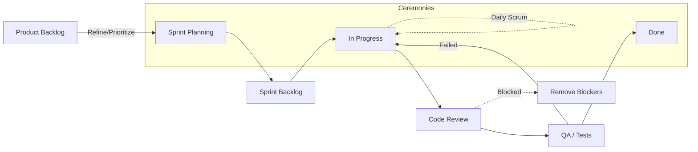

# 🏃 Agile Fundamentals and Jira Guide

> A concise, practical guide to Agile (Scrum/Kanban) with direct mapping to Jira boards, issues, workflows, and reports.

---

## 📚 Contents

- Agile values and principles
- Scrum: roles, events, artifacts
- Kanban essentials
- Estimation and planning
- DoR/DoD and ticket hygiene
- Jira mapping (boards, epics, workflow)
- Sprint lifecycle checklist
- Common JQL snippets
- Flow metrics and reports
- Anti‑patterns to avoid

---

## 💎 Agile Values (Manifesto)

- Individuals and interactions over processes and tools
- Working software over comprehensive documentation
- Customer collaboration over contract negotiation
- Responding to change over following a plan

Principles: deliver frequently, embrace change, sustainable pace, technical excellence, simplicity, self‑organizing teams, regular reflection.

---

## 🧩 Scrum Essentials

- Roles: Product Owner, Scrum Master, Developers
- Events: Sprint (1–4 weeks), Planning, Daily Scrum, Review, Retrospective
- Artifacts: Product Backlog, Sprint Backlog, Increment
- Definition of Ready (DoR): clear story, acceptance criteria, dependencies known
- Definition of Done (DoD): code reviewed, tested, documented, deployed (as applicable)

---

## 📈 Kanban Essentials

- Visualize workflow, limit WIP, manage flow, make policies explicit, improve collaboratively
- Typical columns: To Do → In Progress → In Review → Done
- Key metrics: Cycle time, Throughput, Work in Progress, Cumulative Flow Diagram (CFD)

---

## 🧮 Estimation & Planning

- Story points: relative complexity/effort (e.g., Fibonacci 1,2,3,5,8,13)
- Capacity = team members × available days × focus factor (e.g., 0.7)
- Velocity = average completed story points per sprint (use 3–5 sprints baseline)
- Sizing tips: split >8 points; keep INVEST user stories

---

## 🧼 Ticket Hygiene (DoR/DoD)

- Good story template:
  - As a <user> I want <capability> so that <benefit>
  - Acceptance Criteria (Given/When/Then)
  - Non‑functional: performance, security, observability
- Bugs: steps to reproduce, expected vs actual, logs/screenshots, environment

---

## 🗺️ Jira Mapping

- Hierarchy: Epic → Story/Task → Sub‑task; Bugs link to Stories or Epics as needed
- Boards: Scrum (sprints, backlog) vs Kanban (continuous)
- Workflows: Map statuses to categories (To Do/In Progress/Done) for correct reporting
- Fields: Components (owned areas) vs Labels (ad‑hoc tags)
- Backlog grooming: prioritize, split, add AC, estimate, link to Epics

---

## ✅ Sprint Lifecycle (Checklist)

1) Planning
- Select sprint goal; pull top‑priority, ready stories; check capacity; break into sub‑tasks

2) Execution
- Daily stand‑up (yesterday/today/blockers); keep WIP small; swarming on blockers

3) Review & Retro
- Demo working software; review metrics; capture improvements with owners and due dates

---

## 🔎 JQL Snippets

- My open issues: `assignee = currentUser() AND resolution IS EMPTY ORDER BY updated DESC`
- In progress: `statusCategory = "In Progress" ORDER BY updated DESC`
- Active sprint: `sprint IN openSprints() ORDER BY priority DESC`
- By Epic: `"Epic Link" = ABC-123 ORDER BY rank ASC`
- Missing estimates: `issuetype in (Story, Bug) AND "Story Points" IS EMPTY`

---

## 📊 Flow Metrics & Reports

- Scrum: Velocity, Burndown/Burnup, Sprint Report
- Kanban: CFD, Control Chart (cycle/lead time)
- Healthy signals: stable velocity, narrowing WIP, predictable cycle time

---

## 🚫 Anti‑patterns

- Starting too much (high WIP), skipping reviews/tests, redefining Done mid‑sprint
- Using points as performance targets, changing scope late without renegotiation
- Over‑customized workflows/fields creating friction and report noise

---

*Last updated: May 2026*

---

## 🔄 Detailed Sprint Workflow

High-level sprint lifecycle from backlog to done, with quality gates and ceremonies.



Notes:
- Keep WIP limits in In Progress and Code Review.
- Move only working, test-passed increments to Done (respect DoD).
- Retrospective outputs should inform next Refinement/Planning.

---

## 📐 Example Story Template

```
As a <user persona>, I want <capability> so that <business value>.

Acceptance Criteria
- Given <context> When <action> Then <outcome>
- ...

Non-functional
- Performance: P95 < 200ms
- Observability: logs + metrics in place
```
