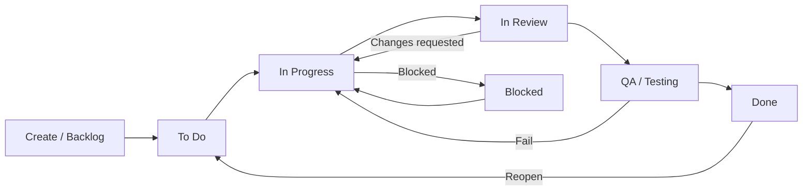

# 🧭 JIRA Notes

> Practical guide to using Atlassian Jira for software teams: projects, issues, workflows, boards, JQL, automation, permissions, reports, and API.

---

## 📚 Contents

- Projects and issue types
- Workflows and schemes
- Boards (Scrum/Kanban)
- JQL cheat sheet
- Filters, dashboards, reports
- Automation rules (Cloud)
- Permissions and roles
- Integrations (GitHub, Slack, Confluence)
- REST API examples
- Interview tips

---

## 🚦 Projects and Issue Types

- Company-managed vs Team-managed projects
- Common issue types: Epic, Story, Task, Sub-task, Bug, Spike
- Key fields: Summary, Description, Assignee, Reporter, Priority, Labels, Components, Fix Version, Story Points
- Good practices:
  - Keep required fields minimal to speed up creation
  - Use Labels for ad-hoc tagging; Components for owned areas (e.g. "api", "web")
  - Define clear Definition of Ready/Done per project

---

## 🔁 Workflows and Schemes

- Status categories: To Do, In Progress, Done (map custom statuses to these)
- Transitions: add validators, conditions, post-functions as needed
- Resolutions: set only on Done-like transitions; keep consistent
- Schemes overview:
  - Workflow Scheme → map workflows to issue types
  - Screen Scheme / Issue Type Screen Scheme → control create/edit/transition fields
  - Field Config(uration) Scheme → required/hidden fields per issue type

---

## 🗺️ Boards (Scrum vs Kanban)

- Scrum: Sprints, Story points, Velocity, Burndown; backlog grooming and sprint planning
- Kanban: Continuous flow, WIP limits, Cycle time, Cumulative Flow Diagram
- Useful board settings:
  - Columns and WIP limits per column
  - Swimlanes: by Epic, by Stories, queries
  - Quick filters: e.g. `assignee = currentUser()`, `labels = hotfix`
  - Card colors: by priority or JQL

---

## 🔎 JQL Cheat Sheet

- My open issues:
  - `assignee = currentUser() AND resolution IS EMPTY ORDER BY updated DESC`
- Work in progress:
  - `statusCategory = "In Progress" ORDER BY updated DESC`
- In active sprint:
  - `sprint IN openSprints() ORDER BY priority DESC`
- By epic:
  - `"Epic Link" = ABC-123 ORDER BY rank ASC`
- Recent bugs (last 7 days):
  - `project = XYZ AND issuetype = Bug AND created >= -7d ORDER BY created DESC`
- Blocked items (issue links):
  - `issueLinkType = "is blocked by" AND statusCategory != Done`
- Missing story points:
  - `issuetype in (Story, Bug) AND "Story Points" IS EMPTY`
- By label/component:
  - `labels = onboarding AND component = api`
- Full-text search:
  - `text ~ "\"rate limit\"" AND project = ABC`
- Date helpers: `startOfDay()`, `startOfWeek()`, `startOfMonth()`, `-14d`

Tips: Use parentheses for precedence; combine with `AND`/`OR` and `NOT`.

---

## ⚙️ Automation (Jira Cloud)

- Triggers: Issue created/updated, transition, comment, schedule, incoming webhook
- Conditions/Branching: Issue fields, related issues (Epic/Stories, Linked issues)
- Actions: Assign, Comment, Edit fields, Transition, Create/Clone/Link issues, Send web request
- Smart values examples:
  - `{{issue.key}}`, `{{issue.summary}}`, `{{issue.assignee.displayName}}`, `{{now}}`
- Example rules:
  - Auto-assign based on Component change
  - Move to "In Review" when a PR is merged (via GitHub integration)
  - Comment on linked issues when parent Epic transitions

---

## 👥 Permissions and Roles

- Project roles: Administrators, Members, Viewers (map to groups when possible)
- Permission scheme highlights: Browse projects, Create/Assign/Transition issues, Resolve issues
- Issue Security Scheme: restrict visibility for sensitive issues
- Good practices: least-privilege, use groups over individuals, audit shared filters/dashboards

---

## 📊 Filters, Dashboards, Reports

- Filters: save and share with team/project roles; use in boards, subscriptions, gadgets
- Dashboard gadgets: Filter Results, Pie Chart by Assignee/Status, Two Dimensional Filter Stats, Created vs Resolved
- Scrum reports: Burndown, Velocity, Sprint Report
- Kanban reports: Cumulative Flow Diagram, Control Chart

---

## 🔌 Integrations

- GitHub/GitLab: development panel (branches, commits, PRs), Smart Commits (e.g. `ABC-123 #comment Fix applied #time 1h #transition Done`)
- Slack: notifications on transitions/comments or via automation webhooks
- Confluence: link design docs/decision records to issues and epics

---

## 🧰 REST API (Jira Cloud)

Authentication: email + API token (Basic Auth). Base URL: `https://your-domain.atlassian.net`.

- Get an issue:
```bash
curl -u email@example.com:API_TOKEN -X GET \
  -H "Accept: application/json" \
  "https://your-domain.atlassian.net/rest/api/3/issue/ABC-123"
```

- Create an issue:
```bash
curl -u email@example.com:API_TOKEN -X POST \
  -H "Content-Type: application/json" \
  --data '{
    "fields": {
      "project": {"key": "ABC"},
      "summary": "Create issue via API",
      "issuetype": {"name": "Task"},
      "description": {"type":"doc","version":1,"content":[{"type":"paragraph","content":[{"text":"Created from API","type":"text"}]}]}
    }
  }' \
  "https://your-domain.atlassian.net/rest/api/3/issue"
```

- Search with JQL:
```bash
curl -u email@example.com:API_TOKEN -G \
  --data-urlencode "jql=project = ABC AND statusCategory != Done ORDER BY updated DESC" \
  "https://your-domain.atlassian.net/rest/api/3/search"
```

---

## 📝 Conventions & Team Hygiene

- Branch naming: `ABC-123-short-context`
- Link PRs to issues; ensure Definition of Done includes docs/tests/monitoring
- Use Components and Labels consistently; avoid polluting with one-off labels
- Groom backlogs weekly; keep WIP limits realistic; close stale tickets

---

## 💡 Interview Tips

- Be ready to explain: how you modeled workflows, used JQL/automation to improve flow, and managed cross-team boards
- Scaling Jira: projects vs boards, filters, components; handling many teams; permissions governance
- Migration gotchas: team-managed → company-managed; custom fields explosion; reporting consistency

---

*Last updated: May 2026*

---

## 🔄 Issue Lifecycle (Example Workflow)



Guidance:
- Only set Resolution on transitions to Done-like statuses.
- Map each custom status to correct category (To Do / In Progress / Done) for reporting.
- Keep transitions minimal; enforce rules via Conditions/Validators, not extra statuses.

---

## 🧪 Sample Automation: Auto-transition on PR Merge

Use GitHub integration + Automation rule:
1. Trigger: "Pull request merged" (development info)
2. Condition: Issue matches JQL `project = ABC AND status = "In Review"`
3. Actions:
   - Transition issue to "QA / Testing"
   - Comment: "PR merged: {{pullRequest.title}} (#{{pullRequest.number}})"
   - Link the PR URL to the issue

---

## 🧩 Recommended Saved Filters (Team)

- Team board: `project = ABC ORDER BY rank ASC`
- WIP: `project = ABC AND statusCategory = "In Progress" ORDER BY updated DESC`
- Unestimated: `project = ABC AND issuetype in (Story, Bug) AND "Story Points" IS EMPTY`
- High priority bugs: `project = ABC AND issuetype = Bug AND priority in (Highest, High) AND resolution IS EMPTY`

---

## 🧭 Jira Terms & Hierarchy

- **Project**: Container for issues, workflows, permissions, and boards.
- **Board**: View of issues via a filter. Scrum boards manage sprints; Kanban boards manage continuous flow.
- **Sprint (Scrum only)**: Timeboxed iteration on a Scrum board; contains a selected subset of issues.
- **Epic**: Large body of work grouping multiple Stories/Tasks/Bugs.
- **Story**: User-facing value increment; estimated with story points.
- **Task**: Non-story work item (engineering/ops). Same lifecycle as a Story.
- **Bug**: Defect to be fixed, may be estimated and included in sprints.
- **Sub-task**: Breaks down a Story/Task/Bug into smaller pieces; not independently planned at Epic level.
- **Component**: Logical area/ownership within a project (e.g., "api", "frontend").
- **Version/Release**: Targeted delivery bucket; issues tracked by Fix Version.
- **Labels**: Free-form tags; use sparingly and consistently.

```mermaid
flowchart TB
  P[Project] --> B1[Board (Scrum)]
  P --> B2[Board (Kanban)]
  B1 --> S((Sprint))
  P --> V[Versions / Releases]
  P --> C[Components]

  E((Epic)) --> ST[Story]
  E --> TK[Task]
  E --> BG[Bug]
  ST --> SUB1[Sub-task]
  TK --> SUB2[Sub-task]
  BG --> SUB3[Sub-task]

  %% Notes: Boards are filter-based; items appear on one or more boards
  B1 -. filter .- E
  B1 -. filter .- ST
  B2 -. filter .- TK
```

Tip: Map every custom status to the correct category (To Do / In Progress / Done) so reports reflect reality.
