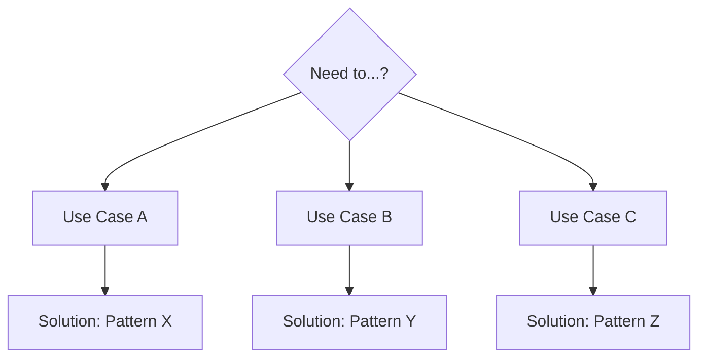
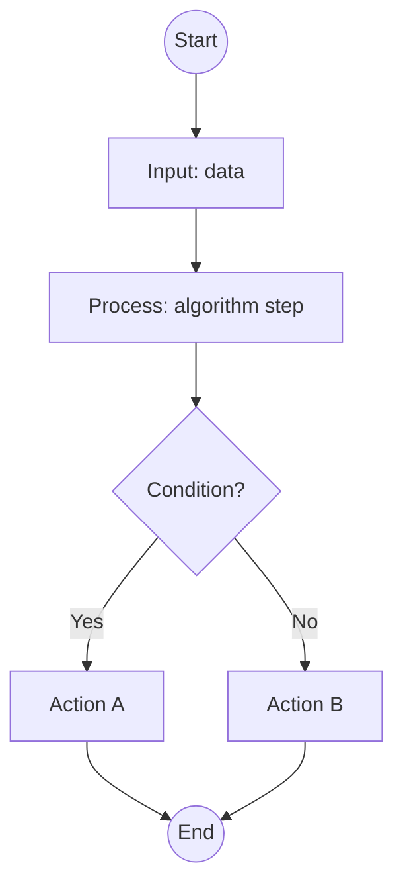
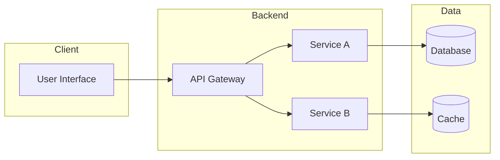
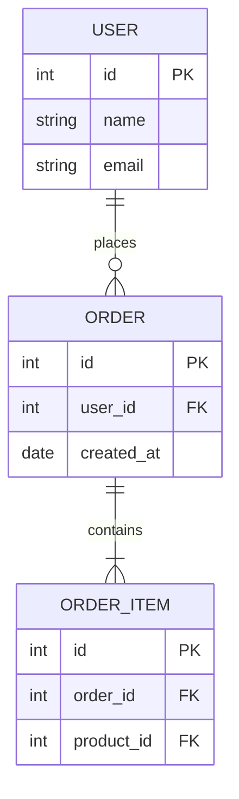
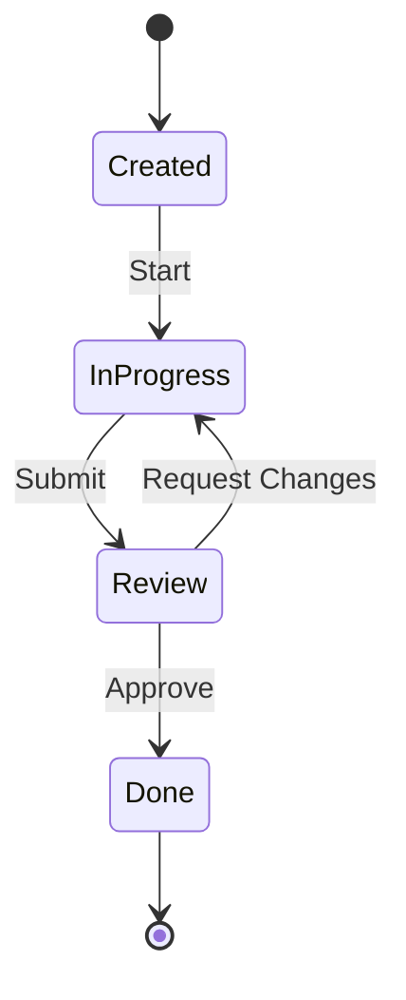
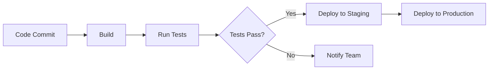

# 📘 [Topic Name] - Complete 101 Guide

> Comprehensive deep-dive guide covering essential concepts, practical examples, visual diagrams, and interview preparation for [Topic Name].

---

## 📚 Table of Contents

- [Quick Reference Card](#-quick-reference-card)
- [The 20% You Need 80% of the Time](#-the-20-you-need-80-of-the-time)
- [Introduction & Overview](#-introduction--overview)
- [Core Concepts](#-core-concepts)
- [Topic-Specific Deep Dives](#-topic-specific-deep-dives)
- [Visual Explanations](#-visual-explanations)
- [Practical Examples](#-practical-examples)
- [Trade-offs & Comparisons](#-trade-offs--comparisons)
- [Cheat Sheet & Quick Reference](#-cheat-sheet--quick-reference)
- [Common Pitfalls & Anti-patterns](#-common-pitfalls--anti-patterns)
- [Troubleshooting & Production Gotchas](#-troubleshooting--production-gotchas)
- [Interview FAQs (20 Questions)](#-interview-faqs-20-questions)
- [Practice Exercises](#-practice-exercises)
- [Related Topics](#-related-topics)

---

## 🎴 Quick Reference Card

| What | Why | When to Use |
|------|-----|-------------|
| Brief definition of the topic | Key benefits and value proposition | Primary use cases and scenarios |

**Key Takeaway**: One-sentence summary of the most important thing to remember.

---

## 🎯 The 20% You Need 80% of the Time

This section highlights the critical concepts and patterns you'll use most frequently.

### Critical Concepts (Master These First)

1. **Concept 1**: Brief explanation and why it's essential
2. **Concept 2**: Brief explanation and why it's essential
3. **Concept 3**: Brief explanation and why it's essential

### Most-Used Patterns/Commands

```bash
# Command 1: Description
command --option value

# Command 2: Description
command --flag
```

### Quick Decision Tree



---

## 💡 Introduction & Overview

### What is [Topic Name]?

Comprehensive definition and context.

### Why Does It Matter?

- **Benefit 1**: Explanation
- **Benefit 2**: Explanation
- **Benefit 3**: Explanation

### Key Use Cases

1. **Use Case 1**: Description
2. **Use Case 2**: Description
3. **Use Case 3**: Description

### Historical Context (Optional)

Brief evolution and why it was created.

---

## 🧩 Core Concepts

### Fundamental Terminology

- **Term 1**: Definition with context
- **Term 2**: Definition with context
- **Term 3**: Definition with context

### Key Principles

1. **Principle 1**: Explanation and implications
2. **Principle 2**: Explanation and implications
3. **Principle 3**: Explanation and implications

### Architecture Overview

High-level view of how components fit together.

---

## 📖 Topic-Specific Deep Dives

### Section 1: [Major Topic Area]

#### Subsection 1.1: [Subtopic]

Detailed explanation with examples.

#### Subsection 1.2: [Subtopic]

Detailed explanation with examples.

---

### Section 2: [Major Topic Area]

#### Subsection 2.1: [Subtopic]

Detailed explanation with examples.

#### Subsection 2.2: [Subtopic]

Detailed explanation with examples.

---

### Section 3: [Major Topic Area]

#### Subsection 3.1: [Subtopic]

Detailed explanation with examples.

---

## 🖼️ Visual Explanations

Use topic-adaptive Mermaid diagrams based on your content type:

### For Algorithms: Flowcharts



### For Systems/Architecture: Component Diagrams



### For Databases: ER Diagrams / Schema



### For Workflows: State/Sequence Diagrams



### For DevOps/Pipelines: Process Flow



**Diagram Guidelines:**
- Use flowcharts for algorithms and processes
- Use component diagrams for system architecture
- Use ER diagrams for database schemas
- Use state diagrams for workflows and lifecycles
- Use sequence diagrams for API interactions
- Keep diagrams focused (one concept per diagram)
- Quote labels containing special characters like `[]` or `{}`

---

## 🚀 Practical Examples

### Example 1: [Scenario Name]

**Context**: Describe the use case

```python
# Code example with inline comments
def example_function(param):
    """
    Docstring explaining what this does
    """
    result = process(param)
    return result
```

**Explanation**:
- What the code does
- Why this approach
- Key points to note

---

### Example 2: [Scenario Name]

**Context**: Describe the use case

```bash
# Shell commands
command --option value
```

**Explanation**:
- What happens
- Expected output
- Common variations

---

### ❌ Bad Example (Anti-pattern)

```python
# Code demonstrating what NOT to do
def bad_approach():
    # Problematic implementation
    pass
```

**Problems**:
- Issue 1: Why it's bad
- Issue 2: Why it's bad

---

### ✅ Good Example (Best Practice)

```python
# Code demonstrating the correct approach
def good_approach():
    # Proper implementation
    pass
```

**Benefits**:
- Benefit 1: Why it's better
- Benefit 2: Why it's better

---

## ⚖️ Trade-offs & Comparisons

### Option A vs Option B

| Aspect | Option A | Option B | Winner |
|--------|----------|----------|--------|
| Performance | Fast | Slower | A |
| Ease of Use | Complex | Simple | B |
| Scalability | High | Medium | A |
| Cost | Expensive | Cheap | B |

**When to use Option A**: Scenarios and conditions

**When to use Option B**: Scenarios and conditions

---

### Comparison Matrix

| Feature | Tool/Approach 1 | Tool/Approach 2 | Tool/Approach 3 |
|---------|----------------|----------------|----------------|
| Feature A | ✅ | ❌ | ✅ |
| Feature B | ⚠️ Partial | ✅ | ❌ |
| Feature C | ✅ | ✅ | ⚠️ Limited |

---

## 📋 Cheat Sheet & Quick Reference

### Common Commands/Syntax

```bash
# Command 1: Description
command1 --flag value

# Command 2: Description
command2 -a -b -c

# Command 3: Description
command3 input > output
```

### Configuration Patterns

```yaml
# Common configuration template
key: value
nested:
  option1: true
  option2: false
```

### Quick Lookup Table

| Task | Command/Code | Notes |
|------|-------------|-------|
| Task 1 | `code here` | Important note |
| Task 2 | `code here` | Important note |
| Task 3 | `code here` | Important note |

---

## ⚠️ Common Pitfalls & Anti-patterns

### Pitfall 1: [Problem Name]

**What happens**: Description of the mistake

**Why it's bad**: Consequences

**How to avoid**:
```python
# Correct approach
solution_code()
```

---

### Pitfall 2: [Problem Name]

**What happens**: Description of the mistake

**Why it's bad**: Consequences

**How to avoid**: Steps to prevent this issue

---

### Pitfall 3: [Problem Name]

**What happens**: Description of the mistake

**Why it's bad**: Consequences

**How to avoid**: Steps to prevent this issue

---

## 🔧 Troubleshooting & Production Gotchas

### Issue 1: [Problem Description]

**Symptoms**:
- What you observe
- Error messages

**Root Cause**: Why this happens

**Solution**:
```bash
# Fix command or code
fix_command --option
```

**Prevention**: How to avoid in the future

---

### Issue 2: [Problem Description]

**Symptoms**: What you observe

**Root Cause**: Why this happens

**Solution**: Step-by-step fix

**Prevention**: How to avoid in the future

---

### Debugging Checklist

- [ ] Check 1: Description
- [ ] Check 2: Description
- [ ] Check 3: Description
- [ ] Check 4: Description

---

## 💼 Interview FAQs (20 Questions)

### Basic Questions (Q1-Q5)

**Q1: What is [Topic] and why is it used?**

> [Topic] is [definition]. It's used because [key benefits]. The main advantage is [primary value proposition].
>
> **Follow-up points**:
> - Historical context or evolution
> - Comparison to alternatives
> - Real-world adoption examples

---

**Q2: What are the key components of [Topic]?**

> The main components are:
> 1. **Component A**: Purpose and function
> 2. **Component B**: Purpose and function
> 3. **Component C**: Purpose and function
>
> **Follow-up points**:
> - How components interact
> - Which is most critical
> - Common configurations

---

**Q3: Explain [Fundamental Concept].**

> [Fundamental Concept] is [definition and explanation]. It works by [mechanism].
>
> **Follow-up points**:
> - Simple analogy
> - Why it matters
> - Common use cases

---

**Q4: What is the difference between [Term A] and [Term B]?**

> **[Term A]**: Definition and characteristics
>
> **[Term B]**: Definition and characteristics
>
> **Key Difference**: The main distinction is [explanation].
>
> **Follow-up points**:
> - When to use each
> - Performance implications
> - Common misconceptions

---

**Q5: How do you [Basic Operation]?**

> To [basic operation], you:
> 1. Step 1
> 2. Step 2
> 3. Step 3
>
> ```bash
> # Example command
> command --option value
> ```
>
> **Follow-up points**:
> - Common options/flags
> - Best practices
> - What to avoid

---

### Intermediate Questions (Q6-Q15)

**Q6: How would you handle [Practical Scenario]?**

> For [scenario], the approach is:
> 1. Analyze [aspect]
> 2. Choose [solution] based on [criteria]
> 3. Implement using [pattern/tool]
>
> **Follow-up points**:
> - Trade-offs of this approach
> - Alternative solutions
> - Monitoring and validation

---

**Q7: What are the trade-offs between [Approach A] and [Approach B]?**

> **Approach A**:
> - Pros: [benefits]
> - Cons: [drawbacks]
>
> **Approach B**:
> - Pros: [benefits]
> - Cons: [drawbacks]
>
> **Recommendation**: Use A when [conditions], use B when [conditions].
>
> **Follow-up points**:
> - Performance comparison
> - Cost implications
> - Team expertise requirements

---

**Q8: Explain how [Feature/Mechanism] works internally.**

> Internally, [feature] works by:
> 1. [Step 1 with technical details]
> 2. [Step 2 with technical details]
> 3. [Step 3 with technical details]
>
> The key optimization is [technical insight].
>
> **Follow-up points**:
> - Data structures used
> - Algorithm complexity
> - Edge cases handled

---

**Q9: How do you optimize [Operation] for performance?**

> To optimize [operation]:
> 1. **Technique 1**: Description and impact
> 2. **Technique 2**: Description and impact
> 3. **Technique 3**: Description and impact
>
> **Follow-up points**:
> - Benchmarking approach
> - Monitoring metrics
> - When optimization matters

---

**Q10: What happens when [Error Scenario] occurs?**

> When [error scenario] occurs:
> - **Immediate effect**: [what breaks]
> - **System behavior**: [how it responds]
> - **Recovery**: [automatic or manual steps]
>
> **Follow-up points**:
> - Prevention strategies
> - Detection methods
> - Mitigation techniques

---

**Q11: How would you debug [Complex Issue]?**

> Debugging approach:
> 1. **Gather information**: [what to check]
> 2. **Isolate the problem**: [narrowing techniques]
> 3. **Test hypothesis**: [verification steps]
> 4. **Fix and validate**: [solution and testing]
>
> **Follow-up points**:
> - Tools to use
> - Common root causes
> - Prevention for future

---

**Q12: Describe a time you used [Topic] to solve a production problem.**

> [Provide a STAR-format answer]:
> - **Situation**: [context]
> - **Task**: [challenge]
> - **Action**: [what you did with the topic]
> - **Result**: [outcome and metrics]
>
> **Follow-up points**:
> - Lessons learned
> - What you'd do differently
> - Long-term impact

---

**Q13: How does [Topic] integrate with [Related Technology]?**

> Integration works through:
> 1. **Connection method**: [how they connect]
> 2. **Data flow**: [what gets exchanged]
> 3. **Configuration**: [setup requirements]
>
> **Follow-up points**:
> - Common integration patterns
> - Performance considerations
> - Security implications

---

**Q14: What are the security considerations for [Topic]?**

> Key security aspects:
> 1. **Authentication**: [methods and best practices]
> 2. **Authorization**: [access control]
> 3. **Data protection**: [encryption, sanitization]
> 4. **Audit logging**: [what to track]
>
> **Follow-up points**:
> - Common vulnerabilities
> - Compliance requirements
> - Security testing approaches

---

**Q15: How do you monitor and maintain [Topic] in production?**

> Monitoring strategy:
> - **Metrics**: [key indicators to track]
> - **Alerts**: [threshold and conditions]
> - **Dashboards**: [visualization approach]
>
> Maintenance tasks:
> - Regular: [daily/weekly tasks]
> - Periodic: [monthly/quarterly tasks]
>
> **Follow-up points**:
> - Tools used
> - SLA targets
> - Incident response process

---

### Advanced Questions (Q16-Q20)

**Q16: Design a [Complex System] using [Topic].**

> System design approach:
>
> ```mermaid
> flowchart TB
>   Client[Clients] --> LB[Load Balancer]
>   LB --> App1[App Instance 1]
>   LB --> App2[App Instance 2]
>   App1 --> Cache[(Cache)]
>   App2 --> Cache
>   App1 --> DB[(Database)]
>   App2 --> DB
> ```
>
> **Components**:
> 1. [Component]: Purpose and scaling strategy
> 2. [Component]: Purpose and scaling strategy
>
> **Trade-offs**:
> - [Consideration 1]
> - [Consideration 2]
>
> **Follow-up points**:
> - Capacity planning
> - Failure modes and recovery
> - Cost optimization

---

**Q17: How would you scale [Topic] to handle [Large Scale Scenario]?**

> Scaling strategy:
> 1. **Horizontal scaling**: [approach and limits]
> 2. **Vertical scaling**: [approach and limits]
> 3. **Partitioning/Sharding**: [strategy]
> 4. **Caching**: [layers and invalidation]
>
> **Bottlenecks to address**:
> - [Bottleneck 1]: Solution
> - [Bottleneck 2]: Solution
>
> **Follow-up points**:
> - CAP theorem implications
> - Consistency vs availability trade-offs
> - Cost vs performance balance

---

**Q18: What are the edge cases and failure modes in [Topic]?**

> **Edge Cases**:
> 1. [Edge case]: How to handle
> 2. [Edge case]: How to handle
>
> **Failure Modes**:
> 1. [Failure]: Detection and recovery
> 2. [Failure]: Detection and recovery
>
> **Resilience patterns**:
> - Circuit breakers
> - Retry with backoff
> - Graceful degradation
>
> **Follow-up points**:
> - Testing strategies
> - Chaos engineering
> - SLA impact

---

**Q19: Compare [Topic] with [Alternative Technology]. When would you choose each?**

> **[Topic]**:
> - Strengths: [list]
> - Weaknesses: [list]
> - Best for: [scenarios]
>
> **[Alternative]**:
> - Strengths: [list]
> - Weaknesses: [list]
> - Best for: [scenarios]
>
> **Decision Matrix**:
> - Choose [Topic] when: [conditions]
> - Choose [Alternative] when: [conditions]
>
> **Follow-up points**:
> - Migration path between them
> - Hybrid approaches
> - Industry trends

---

**Q20: Explain the internal architecture and optimization techniques of [Topic].**

> **Internal Architecture**:
> 1. [Layer/Component]: Technical details
> 2. [Layer/Component]: Technical details
> 3. [Layer/Component]: Technical details
>
> **Optimization Techniques**:
> 1. **[Technique]**: How it works and impact
> 2. **[Technique]**: How it works and impact
> 3. **[Technique]**: How it works and impact
>
> **Advanced Considerations**:
> - Memory management
> - Concurrency model
> - I/O optimization
>
> **Follow-up points**:
> - Performance benchmarks
> - Tuning parameters
> - Version differences

---

## 🛠️ Practice Exercises

### Exercise 1: [Hands-on Task]

**Objective**: [What you'll learn]

**Steps**:
1. Step 1
2. Step 2
3. Step 3

**Expected Outcome**: [What should happen]

**Bonus Challenge**: [Advanced variation]

---

### Exercise 2: [Hands-on Task]

**Objective**: [What you'll learn]

**Steps**:
1. Step 1
2. Step 2
3. Step 3

**Expected Outcome**: [What should happen]

---

### Exercise 3: [Hands-on Task]

**Objective**: [What you'll learn]

**Steps**:
1. Step 1
2. Step 2
3. Step 3

**Expected Outcome**: [What should happen]

---

## 🔗 Related Topics

- [Related Topic 1](path/to/topic1.md) - Brief description
- [Related Topic 2](path/to/topic2.md) - Brief description
- [Related Topic 3](path/to/topic3.md) - Brief description

### Learning Path

1. **Prerequisites**: [Topics to learn first]
2. **This Guide**: [Current topic]
3. **Next Steps**: [Topics to learn after]

---

## 📚 Additional Resources

- Official Documentation: [Link]
- Community Forums: [Link]
- Video Tutorials: [Link]
- Books: [Recommendations]

---

*Last updated: Month Year*
