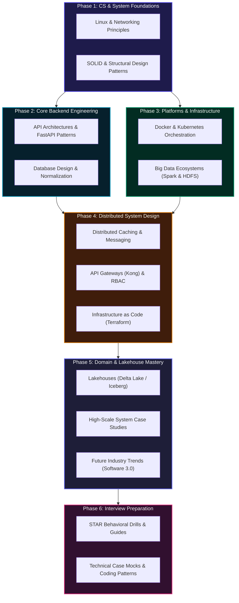

# 📚 SDE2 Interview Preparation — Technical Knowledge Base

Welcome to the **Software Development Engineer 2 (SDE2) Technical Knowledge Base**. This is a highly structured, single-page reference library meticulously compiled for backend engineers, big data developers, full-stack engineers, and DevOps/SRE specialists. It acts as a unified index pointing to core computer science fundamentals, backend engineering, distributed systems, cloud infrastructure, and interview preparations.

---

## 🗺️ SDE2 Mastery Roadmap

Below is the visual learning and architectural roadmap across all tracks. This flowchart maps how core foundational layers integrate into advanced platforms, domain expertise, and final interview preparations:

---

## 📚 Detailed Category Hubs

### [01-Computer Science Fundamentals](01-computer-science-fundamentals/README.md)
Essential computer science patterns and guidelines for writing high-quality code.
* **Design Patterns**: Clean architectures and SOLID principles illustrated with FastAPI examples.
* **Regex Engine**: Detailed regular expressions 101 guide and Python `re` module patterns.
* **Data Structures**: Lists, trees, graphs, and hash tables *(coming soon)*.
* **Algorithms**: Time/space analysis, searching, sorting, and dynamic programming *(coming soon)*.

### [02-Backend Development](02-backend-development/)
Production-grade patterns, framework structures, and API gateways.
* **FastAPI Applications**: Injections, custom middlewares, database scopes, and K8s configuration.
* **API Gateway Hub**: Kong Gateway integration using JWT tokens, rate limiting, and RBAC configs.
* **Databases**: Relational design, index indexing, normalizations, and transaction locks.

### [03-Big Data Engineering](03-big-data-engineering/)
High-performance distributed computing platforms and storage hubs.
* **Foundations**: Hadoop, HDFS distributed layouts, Spark core optimization, Spark SQL plans, and Structured Streaming.
* **Platform Engines**: Kafka event-streaming broker configs, Apache Airflow workflows, Hive Metastore, and Trino query engine.
* **Modern Lakehouse**: Delta Lake/tables, Apache Iceberg format details, and Apache Hudi comparisons.
* **Data Architecture**: High-scale data platform design, governance metadata, and batch vs stream pipelines.

### [04-System Design](04-system-design/)
Scalability patterns, architectural building blocks, and detailed case studies.
* **Foundational Blocks**: Scaling concepts, transport-layer protocols, storage models, databases, and multi-tier caching.
* **Distributed Engines**: Message brokers, consensus engines, high availability, and replication.
* **Production Observability**: Tracing, security best practices, and load estimations.
* **Real-world Case Studies**: URL shorteners, news feeds, chat hubs, notification engines, and streaming platforms.

### [05-Cloud & DevOps](05-cloud-and-devops/)
Infrastructure engineering, automation, and continuous delivery systems.
* **Foundations**: Scripting foundations, Linux file parameters, and networking.
* **Containerization**: Docker engines, Kubernetes clusters, routing, and namespaces.
* **CI/CD Pipelines**: Automated delivery gates, Jenkins orchestrations, and GitOps deployments.
* **Infrastructure**: Terraform scripting, declarative playbooks, and multi-cloud AWS/Azure monitoring.

### [06-Specialized Topics](06-specialized-topics/)
Specialized engineering topics for target domains.
* **IoT & Embedded Systems**: ESP8266 architectures, sensor read routines, and Wi-Fi networks.
* **Testing Engines**: Playwright end-to-end framework, asynchronous assertions, and page configurations.
* **SQL Query Builder**: Custom tool designed to assemble and construct clean SQL queries dynamically.

### [07-Research](07-research/)
Cutting-edge industry developments and future architectural paradigms.
* **AI & Software Development**: Insights into the future of software development (2026–2031) and the Software 3.0 paradigm shift.

### [Interview Preparation](interview-prep/)
Comprehensive interview preparation resources for SDE2 positions.
* **Behavioral**: STAR method frameworks, common behavioral questions, leadership principles, and team collaboration scenarios.
* **Coding Patterns**: Two pointers, sliding windows, tree BFS/DFS, graph traversals, and dynamic programming patterns.
* **Quick Reference**: Time/space complexity cheat sheets, syntax helpers, system design templates, and common mistakes to avoid.

---

## 📊 Technical Content Status

| Focus Area | Directory Reference | Completeness | Covered Core Topics |
| :--- | :--- | :---: | :--- |
| **CS Fundamentals** | [01-computer-science-fundamentals/](01-computer-science-fundamentals/) | 🟡 Partial | SOLID principles, Regex parsing, structural patterns |
| **Backend Development** | [02-backend-development/](02-backend-development/) | 🟢 Complete | FastAPI framework, Kong API Gateway, SQL Database architectures |
| **Big Data Engineering** | [03-big-data-engineering/](03-big-data-engineering/) | 🟢 Complete | Apache Spark, Kafka integrations, Delta Lake lakehouses, Airflow |
| **System Design** | [04-system-design/](04-system-design/) | 🟢 Complete | Multi-tier scaling, distributed consistency, 10+ detailed case studies |
| **Cloud & DevOps** | [05-cloud-and-devops/](05-cloud-and-devops/) | 🟢 Complete | Linux, Networking, Docker, K8s clusters, IaC (Terraform), Monitoring |
| **Specialized Topics** | [06-specialized-topics/](06-specialized-topics/) | 🟢 Complete | ESP8266 IoT configurations, Playwright testing, SQL Query Builders |
| **Industry Research** | [07-research/](07-research/) | 🟢 Active | Software 3.0, future of engineer roles, AI-assisted coding |
| **Interview Preparation** | [interview-prep/](interview-prep/) | 🟢 Complete | STAR behavioral questions, coding patterns, preparation timelines |

---

## 🤝 Contributing & Standards

This knowledge base is continuously updated to keep pace with modern engineering standards. All additions and modifications must align with the formatting guidelines.
* **Note Consistency**: When contributing or adding new files, please follow the [Notes Template](NOTES_TEMPLATE.md) guidelines.
* **Folder Structure**: Place notes inside their respective subdirectories under the correct category folder structure.

---
**Last Modernized**: May 2026 | **Status**: Active Production Hub | **Target**: Premium SDE2 Interview Preparation Reference
